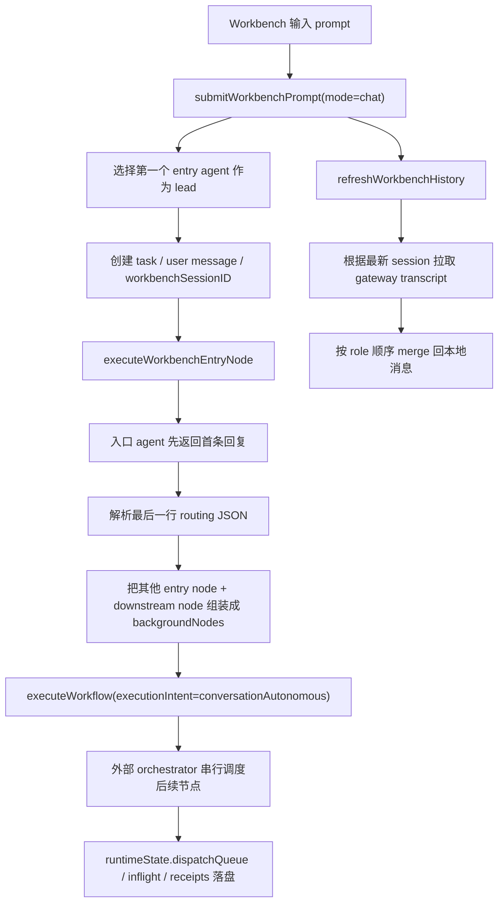

# 聊天模式业务流程评审与整改建议

日期：2026-03-23

## 1. 评审目标

本文用于系统性评估 Workbench 聊天模式当前的业务流程实现，回答 4 个问题：

- 当前聊天模式的真实运行链路是什么
- 它和目标设计之间有哪些结构性偏差
- 这些偏差会带来哪些业务后果
- 应按什么顺序整改，才能把风险降到最低

本次评审聚焦以下入口与核心链路：

- `MessagesView`
- `AppState.submitWorkbenchPrompt`
- `OpenClawService.executeWorkbenchEntryNode`
- `OpenClawService.executeWorkflow`
- `refreshWorkbenchHistory / mergeWorkbenchTranscript`

## 2. 当前业务流程

### 2.1 聊天模式的实际执行链路

### 2.2 当前实现的关键特征

- 聊天模式先由入口 agent 给出首条回复。
- 首条回复之后，后续协作会回到外部 orchestrator 的节点调度逻辑。
- agent 仍被要求在最后一行输出 routing JSON。
- Workbench 消息展示按 `workflowID` 聚合，不按真正线程隔离。
- 历史回放依赖“最新一个 workbench session”，并以覆盖本地消息的方式合并。

## 3. 目标设计基线

现有设计文档已经明确了聊天模式应采用的产品模型：

- 软件给入口 agent 下发的是“协作边界包”，而不是逐节点执行命令。
- 聊天模式不再强制最后一行 routing JSON。
- 聊天模式不应要求每次内部协作都回到外部 orchestrator 重新排程。
- 必须区分聊天模式的 delegation 与执行模式的 dispatch。
- 聊天模式与执行模式可以共享控制面和存储面，但不能共享同一套线程语义。

这意味着聊天模式的核心对象应该是：

- `thread`
- `turn`
- `delegation`
- `approval`
- `artifact`

而不是把它降格为“先回复一下，再进入 workflow run”。

## 4. 系统性设计缺陷

### D1. 聊天模式仍然建立在执行模式的外部调度骨架上

严重性：高

现象：

- 入口 agent 首轮回复后，系统把其余节点继续交给 `executeWorkflow` 串行调度。
- 入口 agent 并没有真正获得“自治协作入口”的控制权。
- 聊天模式的后半段实质上退化成“带首条回复的 run 模式”。

根因：

- 控制模型没有拆开，聊天模式仍复用了 workflow dispatch 的主循环。
- `conversationAutonomous` 只是 execution intent 标签，并未对应一套独立控制器。

业务后果：

- 聊天模式无法表达真正的内部 delegation。
- 聊天模式的灵活性被 workflow 图结构硬绑定。
- 用户看到的是“聊天”，系统实际跑的是“半聊天半执行”。

代码证据：

- `AppState.submitWorkbenchPrompt` 在聊天模式下调用 `executeWorkbenchEntryNode` 后，又调用 `executeWorkflow` 继续后台流程。
- `OpenClawService.executeWorkflow` 仍按节点队列顺序调度。

### D2. 聊天模式仍强制 routing JSON，和目标产品模型冲突

严重性：高

现象：

- 标准 instruction 和 fast entry instruction 都要求“最后一行必须输出 JSON routing”。
- 协议记忆还会因为缺少 machine tail 持续对 agent 做纠偏。

根因：

- 聊天模式没有从“节点路由协议”迁移到“边界包 + 内部协作”的会话协议。
- 当前实现把“是否继续”这个权力仍放在外部 orchestrator 可解析的 machine tail 上。

业务后果：

- 聊天模式对 agent 的输出形态施加了执行模式约束。
- visible reply 与 machine tail 耦合，脆弱且不自然。
- 设计文档中的 `visibleReply / collaborationSummary / suggestedNextActions / artifacts / riskFlags / delegationStats` 没有被落地。

### D3. 线程模型与会话模型未拆分，chat / run / chat->run 互相污染

严重性：高

现象：

- `chat` 和 `run` 共用 `workbenchSessionID(workflowID, agentID)`。
- 消息列表只按 `workflowID` 过滤。
- 同一 workflow 下的聊天记录、运行记录、状态消息会进入同一个面板。

根因：

- 只有 metadata 上的 `workbenchThreadType/workbenchThreadMode`，但没有真正成为一等索引键。
- UI 和存储层都没有基于 thread identity 做隔离。

业务后果：

- 聊天记录和执行记录混在一起，用户难以理解上下文。
- chat->run 无法成为显式状态跃迁，只会变成一堆混杂事件。
- 后续做 thread list、resume、investigation 时会持续出错。

### D4. 历史回放采用“最新 session + 按 role 覆盖”的方式，具有破坏性

严重性：高

现象：

- 历史刷新时只选择 workflow 下最近一个 workbench session。
- merge 逻辑只按 `user/assistant` 顺序匹配本地消息。
- 命中后会直接覆盖本地 message content、timestamp、metadata。
- merge 完后统一改写成聊天模式语义。

根因：

- 本地消息与远端 transcript 没有稳定的 turn identity。
- merge 逻辑没有 remote message id、hash、顺序校验或冲突保护。

业务后果：

- run 线程可能被聊天历史覆盖。
- 本地编辑态、占位态、流式态消息可能被错误替换。
- 一旦多线程交错、重试、补拉历史，就容易出现错位和重复。

### D5. 停止能力只覆盖入口 run，无法控制聊天后的后台续跑

严重性：高

现象：

- UI 的 Stop 按钮仅依赖 `activeGatewayRunID + activeGatewaySessionKey`。
- 这一状态只在入口 `executeWorkbenchEntryNode(... trackActiveRemoteRun: true)` 时登记。
- 聊天首轮回复后续跑到 `executeWorkflow`，后续节点并没有统一纳入同一套 run registry。

根因：

- 会话控制能力只覆盖“首个可见入口 run”，没有覆盖整条聊天线程的活动执行单元。
- 缺少 thread 级别的 active runs registry。

业务后果：

- 用户以为自己停止了聊天流程，实际上可能只停了首个入口回复。
- 背景节点继续跑时，UI 缺少明确控制面。

### D6. 多入口 workflow 的入口选择规则是隐式且不可解释的

严重性：中

现象：

- 系统会收集所有 entry-connected agents。
- 但真正作为 lead 的只有排序后的第一个节点。
- 排序规则依赖画布坐标。

根因：

- 产品没有定义“多入口聊天时谁是主入口 agent”的业务规则。
- 当前实现把布局顺序当成了业务决策依据。

业务后果：

- 画布轻微调整就可能改变聊天入口行为。
- 日志里说“prompt will be delivered to agents”，实际却只先投给一个 agent，容易误导。

### D7. 聊天中的观测数据仍按 dispatch receipt 建模，无法表达 delegation

严重性：中

现象：

- 聊天模式的 runtime event 仍沿用 `taskDispatch / taskAccepted / taskProgress / taskResult`。
- transcript 回放写入的 runtime event 也被固定成 `gatewayChat + conversationAutonomous`。
- 当前没有独立的 `turn receipt / delegation receipt / artifact receipt`。

根因：

- 观测模型沿用了执行模式的数据结构。
- planned transport / actual transport / fallback reason 没有在聊天线程层面稳定落地。

业务后果：

- Ops 侧无法区分“真实 delegation”与“执行 dispatch”。
- 诊断数据看起来完整，实际语义是错的。
- 后续 conversation projection 的准确性会很差。

### D8. 聊天线程被全局 `isExecuting` 锁死，缺乏真正的会话交互能力

严重性：中

现象：

- 提交聊天前要求 `!openClawService.isExecuting`。
- 发送按钮在执行期间被整体禁用。
- 聊天首轮回复后若后台还在继续跑，用户无法继续在同一工作台自然追问。

根因：

- 执行状态是全局单例，不是 thread-scoped。
- 系统默认“一个工作台同一时刻只有一条执行链”。

业务后果：

- 体验更像“阻塞式任务台”，而不是会话式工作台。
- 聊天模式无法支持“边聊边观察背景协作”的产品心智。

## 5. 缺陷归类

可以把以上问题归纳为 4 类根问题：

### 5.1 控制模型未拆分

- 聊天模式继续依赖执行模式调度器
- routing JSON 仍然是核心协议
- 后台续跑仍是 workflow dispatch

### 5.2 身份模型未拆分

- session identity 与 thread identity 混用
- workflow 级过滤代替 thread 级过滤
- run/chat/chat->run 无显式跃迁

### 5.3 观测模型未拆分

- delegation 被记录成 dispatch
- transport 语义存在硬编码
- transcript merge 没有稳定 turn identity

### 5.4 控制面能力不完整

- stop 只管入口 run
- 多入口策略不明确
- 全局 busy 锁阻塞聊天交互

## 6. 整改优先级

### P0. 先止血：身份隔离与控制面补齐

目标：

- 不再让 chat / run 混线
- 不再让历史回放破坏本地线程
- 不再让后台续跑失控

建议动作：

1. 引入 thread 一等标识
   - 至少包含：`workflowID + mode + threadType + threadID + entryAgentID`
   - `workbenchSessionID` 不再兼做 thread key

2. 消息面板改为按 thread 过滤
   - `workflowID` 只能作为上层分组条件
   - 不能再作为唯一筛选条件

3. transcript merge 改为非破坏式
   - 引入 remote turn identity 或本地映射表
   - 命中失败时追加，不覆盖不确定消息
   - 禁止在 merge 时跨模式改写 metadata

4. 引入 thread 级 active run registry
   - 一个 thread 可以关联多个 active runs
   - Stop 需要停止整个 thread 上的活跃执行单元，或至少提供分项停止

5. 明确多入口策略
   - 只能单入口：启动前校验并要求配置主入口
   - 或支持多入口：必须有清晰的入口仲裁规则，不能依赖坐标排序

### P1. 纠偏：把聊天模式从执行模式控制器中拆出来

目标：

- 聊天模式只负责会话 turn，不负责逐节点排程
- 入口 agent 真正成为自治协作入口

建议动作：

1. 新建 Conversation Controller
   - 输入：用户消息 + 协作边界包
   - 输出：assistant turn receipt

2. 移除聊天模式中的强制 routing JSON
   - 聊天模式输出改为结构化 turn：
     - `visibleReply`
     - `collaborationSummary`
     - `suggestedNextActions`
     - `artifacts`
     - `riskFlags`
     - `delegationStats`

3. 聊天内部协作改为 delegation 模型
   - 允许入口 agent 自主选择 subagent
   - 高风险 delegation 走 approval
   - 不再用 workflow dispatch receipt 表达内部协作

4. chat->run 变成显式跃迁
   - 由聊天 turn 产出“建议转正式执行”
   - 用户确认后再启动新的 `run.controlled` thread

### P2. 补齐观测与落盘

目标：

- 让 Ops Center 能看懂聊天线程到底发生了什么

建议动作：

1. 新增 conversation 专属落盘
   - `turns.ndjson`
   - `delegation.ndjson`
   - `spans.ndjson`
   - `artifacts.ndjson`

2. 区分 4 类 receipt
   - `ConversationTurnReceipt`
   - `DelegationReceipt`
   - `ApprovalDecisionReceipt`
   - `ArtifactWriteReceipt`

3. 每条记录都补齐
   - `plannedTransport`
   - `actualTransport`
   - `fallbackReason`
   - `threadType`
   - `threadMode`

### P3. 升级 UX 与产品心智

目标：

- 让用户明确知道自己在“聊天”、还是在“执行”

建议动作：

1. Workbench 顶部展示 thread identity
   - Chat
   - Run
   - Chat -> Run

2. 提供 thread 列表
   - 当前 workflow 下可以并存多个聊天线程和执行线程

3. 对后台协作提供显式状态区
   - 正在协作
   - 等待审批
   - 建议转执行
   - 已写出 artifacts

## 7. 推荐实施顺序

建议分 4 个迭代做，而不是一次性重写：

### Iteration 1

- thread key 拆分
- message filtering 改造
- transcript merge 改为非破坏式
- active run registry

### Iteration 2

- 聊天控制器从 `executeWorkflow` 主循环中分离
- 移除聊天模式 routing JSON 强约束
- 引入 turn output schema

### Iteration 3

- delegation / approval / artifact 落盘
- Ops Center conversation projection

### Iteration 4

- thread list
- chat->run 显式跃迁
- 多入口策略产品化

## 8. 验收标准

聊天模式整改完成后，至少应满足以下标准：

- 同一 workflow 下，chat 与 run 不会混在同一个消息列表中
- transcript refresh 不会覆盖错误的本地消息
- 聊天线程停止时，所有关联活跃 run 都能被解释和控制
- 聊天模式不再要求最后一行 routing JSON
- 聊天模式的内部协作不再落成 workflow dispatch
- Ops Center 能区分 delegation 与 dispatch
- planned transport / actual transport / fallback reason 可以被稳定追踪
- chat->run 是显式业务动作，而不是隐式混线

## 9. 一句话结论

当前聊天模式最大的设计问题不是“入口回复慢”或“某个函数写得乱”，而是：

**它还没有真正成为一个会话系统，而只是把执行系统包装成了会话入口。**

如果不先拆开控制模型、身份模型和观测模型，后续所有“补功能”都会继续建立在混线基础上，复杂度只会越来越高。
