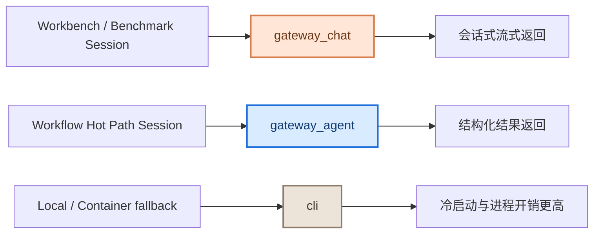

# 高速通信热路径阶段报告

更新时间：2026-03-21

## 阶段结论

本阶段已经完成“高速通信热路径”验证闭环，结论可以直接用于 README 或对外展示：

- `workflow_hot_path` 在真实 live benchmark 中稳定命中 `gateway_agent`
- 最新一轮成功报告中，`workflow_hot_path` 平均完成耗时为 `1690 ms`
- 同轮对比下，`cli` 平均完成耗时为 `7791 ms`
- 因此当前热路径相对 CLI 的端到端速度提升为 `4.61x`


## 一图看懂



## 官方展示口径

推荐在 README / 汇报材料中直接使用下面这段话：

> Multi-Agent-Flow 已完成高速通信热路径验证。最新 live benchmark 显示，`workflow_hot_path` 100% 命中 `gateway_agent`，平均完成耗时 `1690 ms`，相较 CLI 的 `7791 ms` 提升约 `4.61x`。

## 本次采用的正式结果

正式展示采用的是最新一轮“完整成功退出”的 live benchmark 报告：

- 报告文件：`~/Library/Application Support/OpenClaw/benchmarks/transport-benchmark-2026-03-21T05-21-11Z-local.json`
- 验证命令：`npm run benchmark:live`
- 验证方式：`XCTest + OpenClawService.runTransportBenchmark() + benchmark report inspect`

### 核心结果表

| Transport | Observed | Avg Completion | 对 CLI 加速比 | 结果 |
| --- | --- | ---: | ---: | --- |
| `cli` | `cli` | `7791 ms` | `1.00x` | 基线 |
| `gateway_chat` | `gateway_chat` | `3057 ms` | `2.55x` | 通过 |
| `gateway_agent` | `gateway_agent` | `1727 ms` | `4.51x` | 通过 |
| `workflow_hot_path` | `gateway_agent` | `1690 ms` | `4.61x` | 通过 |

### 热路径命中情况

| 指标 | 数值 |
| --- | --- |
| Expected transport | `gateway_agent` |
| Observed transport | `gateway_agent` |
| Matched | `1 / 1` |
| Mismatch | `0 / 1` |
| Pass / Fail | `PASS` |

## 阶段判断

从当前结果看，这个功能已经从“设计验证阶段”进入“可展示的阶段性落地状态”：

1. 路由规则已固化
   `workflow-*` 会优先走 `gateway_agent`，`workbench-*` / `benchmark-*` 会走 `gateway_chat`。

2. 自动化校验已具备
   现在同时有路由单测、离线报告检查、live benchmark 三层验证。

3. 真实性能收益已拿到
   不再只是代码推断，而是有真实 benchmark JSON 作为依据。

4. README 展示材料已具备
   这份文档和配套图可直接挂到 README 或项目文档首页。

## 为什么这里能更快

当前阶段的主要收益，不是来自“模型本身更快”，而是来自“通信热路径更短”：

- `workflow_hot_path` 直接命中 `gateway_agent`
- 避免了 CLI 进程冷启动、进程间 I/O、额外序列化和本地命令链路开销
- 在本地 gateway 可用时，热路径更接近“常驻连接 + 直接执行”

这也是为什么同轮 benchmark 中：

- `workflow_hot_path` 与 `gateway_agent` 基本持平
- 二者都显著快于 `cli`
- `gateway_chat` 介于两者之间

## 波动说明

在前两次预热采样中，`workflow_hot_path` 相对 CLI 的提升曾分别达到约 `6.96x` 与 `11.32x`。最终展示采用 `4.61x` 这一轮，是因为它满足两个条件：

- 真实 benchmark 完整跑通
- 测试进程最终正常退出，适合作为对外引用的“正式口径”

因此，建议把当前阶段的外部表达定义为：

- 保守展示值：`4.61x`
- 方向性判断：高速热路径对 CLI 存在显著优势，且收益稳定

## 复现方法

在仓库根目录执行：

```bash
npm run benchmark:live
```

如果只想检查最新报告中的热路径结果：

```bash
npm run benchmark:hot-path
```

## 下一阶段建议

下一阶段不再是“证明这条路是否成立”，而是继续把结果做厚：

- 把 live benchmark 从 `1 iteration` 扩大到 `3-5 iterations`
- 固化多轮均值、P95、首包耗时和标准差
- 继续围绕 agent 间通信协议，把更多工作流消息交换压到 `gateway_agent` 热路径
- 把 benchmark 结果自动汇总到 README / 发布说明

## 相关实现

- 路由 helper：`Multi-Agent-Flow/Sources/Services/OpenClawTransportRouting.swift`
- 路由测试：`Multi-Agent-FlowTests/OpenClawTransportRoutingTests.swift`
- live benchmark 测试：`Multi-Agent-FlowTests/OpenClawTransportBenchmarkLiveTests.swift`
- live benchmark 脚本：`scripts/run-live-transport-benchmark-test.sh`
