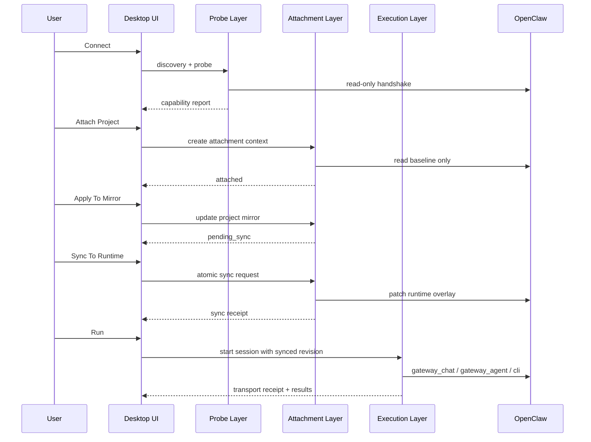

# OpenClaw 交互方案

最后更新：2026-03-22
状态：方案拟定

## 目的

本文档定义 Multi-Agent-Flow 下一代 OpenClaw 交互方案。

这版方案不只修复当前已暴露的连接层问题，也要同时满足以下目标：

- 对话路径具备高速通信体验
- 工作流路径具备稳定、可追踪、可恢复的执行能力
- 设计态、会话态、运行态职责清晰分层
- 用户能明确知道“已连接”“已附着”“已同步”“正在运行”分别意味着什么
- local、container、remote 三种部署下行为尽可能一致

## 本方案要解决的问题

当前系统已经暴露出一组结构性问题，但影响范围不止现有 5 个问题：

1. `Connect` 仍混入了会话准备、mirror staging、清理副作用等行为。
2. `Apply`、`Sync Session`、`Run` 的产品语义与代码语义并不完全一致。
3. CLI、Gateway、会话同步三种能力被折叠成了一个模糊的“已连接”状态。
4. 对话高速通信和工作流热路径虽然都依赖 OpenClaw，但没有类型化 session 和统一 transport 契约。
5. 运行时写回不是原子提交，容易产生半同步状态。
6. live runtime 当前仍被当作“可整目录替换”的资源，风险过高。
7. UI 缺少稳定、可信、可解释的状态模型，用户很难判断当前是否真的能聊、能跑、能发布。

## 产品目标

重构后的 OpenClaw 交互应满足：

1. `Connect` 默认是只读动作。
2. `Attach Project`、`Sync To Runtime`、`Run` 是三个显式生命周期步骤。
3. 对话默认优先走 `gateway_chat`，并围绕低延迟优化。
4. 工作流默认优先走 `gateway_agent`，并围绕调度、追踪、恢复优化。
5. CLI 是受控 fallback，而不是上层状态机不可见的“隐藏路径”。
6. 编辑器在离线时依然可工作。
7. 用户能明确分辨：
   - runtime 是否 ready
   - project 是否 attached
   - mirror 是否 dirty
   - runtime 是否 synced
   - 当前对话/工作流分别能否走高速路径

## 设计原则

### 1. 一套能力契约

所有 UI、执行入口、诊断视图都必须消费同一套 capability report 和 attachment state。

### 2. 设计态与运行态分离

Workflow Editor 只管理项目设计与 node-local managed workspace，不直接承担运行入口。

### 3. 会话类型显式化

系统不能继续依赖 `workflow-*`、`workbench-*`、`agent:*` 这类字符串前缀推断业务语义，应改为显式 session type。

### 4. 写回必须显式且可审计

任何写入 live runtime 的动作都要生成 receipt，并能解释“写了什么、写到哪、是否完整成功”。

### 5. 高速路径与稳定路径分流

低延迟对话和稳定工作流不共享一套含糊的 transport 策略，但共享底层 capability 与 observability。

## 一等对象

本方案引入以下一等对象：

- `OpenClawCapabilityReport`
- `OpenClawAttachmentContext`
- `ProjectMirrorRevision`
- `RuntimeSyncReceipt`
- `ConversationSession`
- `WorkflowRunSession`
- `InspectionSession`
- `TransportPlan`
- `TransportReceipt`

## 总体架构

新的 OpenClaw 交互固定为 5 层。

### 1. Discovery Layer

职责：

- 识别部署类型：`local | container | remoteServer`
- 定位 runtime root、gateway endpoint、config path
- 收集 inventory 候选和环境诊断信息

约束：

- 只读
- 不创建 session
- 不准备 mirror
- 不修改 live runtime

### 2. Probe Layer

职责：

- 探测 CLI 可用性
- 探测 Gateway reachability / auth / handshake
- 探测 `gateway_agent`、`gateway_chat`、`session history`、`project attachment` 能力
- 生成统一 `OpenClawCapabilityReport`

输出结构建议：

```text
OpenClawCapabilityReport
  deploymentKind
  phase
  capabilities:
    cliAvailable
    gatewayReachable
    gatewayAuthenticated
    gatewayAgentAvailable
    gatewayChatAvailable
    projectAttachmentSupported
    sessionHistoryAvailable
  inventory:
    agents
    sourceOfTruth
  health:
    lastProbeAt
    latencyMs
    degradationReason
  warnings
  errors
```

### 3. Attachment Layer

职责：

- 为项目建立 `OpenClawAttachmentContext`
- 创建或恢复 runtime overlay
- 维护 baseline、mirror、runtime overlay 三者关系
- 执行 attach / sync / detach / restore

核心规则：

- `Project Mirror` 是设计态真相源
- `Runtime Overlay` 是本项目附着到运行态后的工作副本
- 不允许再整目录替换 live runtime root
- 所有 sync 必须基于 diff / patch / receipt

### 4. Execution Layer

职责：

- 根据 session type 和 capability 生成 `TransportPlan`
- 执行对话、工作流、检查类任务
- 管理 retry、fallback、resume
- 产出 dispatch / event / receipt

### 5. Observability Layer

职责：

- 统一记录 attachment、sync、dispatch、transport、result receipt
- 区分 `plannedTransport` 与 `actualTransport`
- 为 Ops Center、Execution View、Workbench 提供统一事实来源

## 新的交互生命周期

### 1. Connect

`Connect` 的唯一职责是：发现并探测运行时能力。

结果应只更新：

- capability report
- inventory snapshot
- connection phase

`Connect` 不应：

- 创建项目 session
- 准备 mirror
- 对 live runtime 做任何写入
- 宣称“当前项目已同步”

### 2. Attach Project

当用户明确希望当前项目和 OpenClaw 产生运行时关系时，执行 `Attach Project`。

它负责：

- 读取最近一次 project mirror
- 读取 runtime baseline
- 建立 attachment context
- 准备 runtime overlay
- 标记该项目是否具备后续 sync/run 能力

`Attach Project` 的结果是“有了可写上下文”，不是“已经发布新配置”。

### 3. Apply To Project Mirror

这是设计态动作。

它负责：

- 读取 node-local managed workspace
- 更新 project mirror
- 计算 `appliedToMirrorRevision`
- 保留 `pendingSyncToRuntimeRevision`

它不应：

- 改写 live runtime
- 伪装成 runtime 已发布

### 4. Sync To Runtime

这是运行态提交动作。

必须是原子性的逻辑提交，至少包含：

- managed markdown 文件
- runtime agent binding
- communication allow list
- 必要的 runtime metadata

只有所有必需子步骤都成功时，才能将：

- `syncedToRuntimeRevision = appliedToMirrorRevision`
- attachment state 置为 `synced`

若任一步失败：

- 保持 `pending_sync`
- 生成失败 receipt
- 告知用户“哪些子步骤成功、哪些失败、当前 live runtime 是否处于部分更新状态”

### 5. Run

`Run` 只消费已存在的 capability 和 attachment 事实，不隐式补做 sync。

若当前存在新 mirror 但未 sync，应明确给用户两个选项：

1. 运行已同步版本
2. 先同步新版本再运行

## 对话高速通信方案

### 目标

- 首 token 尽可能快
- 长连接尽可能稳定
- 可中断
- 可恢复
- 不牺牲用户对当前状态的可理解性

### 适用对象

- Workbench 对话
- agent 直达对话
- inspection / debug / replay 类对话

### 会话类型

定义显式类型：

```text
ConversationSession
  id
  attachmentContextID?
  gatewaySessionKey
  preferredTransport = gateway_chat
  fallbackPolicy
  preparedAt
  lastActivityAt
```

### 传输策略

- 首选 `gateway_chat`
- local/container 下可选 CLI compatibility fallback
- remote 下不允许静默改成另一套契约

### 性能优化点

1. 连接成功后预热 websocket
2. 复用 gateway session key
3. 为对话路径维护轻量 keepalive
4. 支持流式 delta，而不是整段重绘
5. 支持 abort / interrupt
6. 在 UI 上明确标示是否命中低延迟路径

### UX 要求

用户在对话区应一眼看到：

- 当前会话类型
- 当前 transport：`gateway_chat` / `cli_compat`
- 是否处于低延迟模式
- 是否发生降级
- 当前 abort 是否可用

## 工作流运行方案

### 目标

- 可预测
- 可追踪
- 可恢复
- 对 multi-agent 调度友好

### 会话类型

```text
WorkflowRunSession
  id
  workflowID
  attachmentContextID
  syncedRevision
  preferredTransport = gateway_agent
  nodeDispatches[]
  inflightNodes[]
  completedNodes[]
  failedNodes[]
```

### 运行前提

工作流执行前应通过 `Preflight`：

- workflow 结构有效
- agent binding 可解析
- attachment context 存在
- 若策略要求最新配置，则 `syncedRevision >= requiredRevision`
- runtime isolation 检查通过
- 所需 transport capability 可用

### 传输策略

- workflow hot path 首选 `gateway_agent`
- local/container 下 gateway 失败时，可按节点 fallback 到 CLI
- fallback 不是静默行为，必须进入 receipt
- remote 模式下 gateway 失败直接报错，不自动改写契约

### 可靠性机制

建议引入：

- `DispatchReceipt`
- `AttemptReceipt`
- `NodeResultReceipt`
- `RoutingReceipt`
- `WorkflowRunResumePoint`

这样可以支持：

- timeout 后有限重试
- reconnect 后恢复 inflight / queued 状态
- 对失败节点做精确调查

### UX 要求

运行区应明确展示：

- 当前基于哪个 synced revision 运行
- 当前 workflow session 是否命中热路径
- 哪些节点发生了 fallback
- 当前失败是否可恢复

## 统一 transport 策略

建议固定成以下矩阵：

| 场景 | 首选 transport | local/container fallback | remote fallback |
| --- | --- | --- | --- |
| 对话 | `gateway_chat` | `cli_compat` 可选 | 不允许 |
| 工作流节点 | `gateway_agent` | `cli` 可选 | 不允许 |
| 诊断/检查 | `gateway_chat` 或只读 gateway API | 可退化为 CLI probe | 不允许静默改写 |

所有运行记录必须区分：

- `plannedTransport`
- `actualTransport`
- `fallbackReason`

## 状态模型

### 1. Runtime 状态

```text
RuntimeState
  phase:
    idle | probed | ready | degraded | detached | failed
  capabilityReport
```

### 2. Attachment 状态

```text
AttachmentState
  stage:
    inactive | attached | pending_sync | synced | conflict | restore_required
  appliedToMirrorRevision
  syncedToRuntimeRevision
  lastSyncReceiptID
  lastFailureReceiptID
```

### 3. Session 状态

```text
SessionState
  type:
    conversation | workflow_run | inspection
  lifecycle:
    prepared | active | aborting | completed | failed | resumable
  transport:
    planned
    actual
```

## 用户界面建议

### 顶层状态不再使用单一“已连接”

建议拆成 3 组状态：

1. Runtime
   - `Runtime Ready`
   - `Runtime Degraded`
   - `Runtime Detached`

2. Project
   - `Mirror Dirty`
   - `Pending Sync`
   - `Runtime Synced`

3. Fast Path
   - `Conversation Fast Path Ready`
   - `Workflow Hot Path Ready`

### 推荐主按钮

建议统一成：

- `Connect`
- `Attach Project`
- `Apply To Mirror`
- `Sync To Runtime`
- `Run`

避免继续让 `Apply` 一词承载“保存、本地生效、运行时写回”三种模糊含义。

### 推荐提示语

- 当 mirror 有更新但未 sync：
  `项目镜像已更新，当前运行时仍停留在 revision N。`
- 当工作流准备运行旧版本：
  `当前将基于已同步 revision N 运行。你也可以先同步 revision N+1。`
- 当对话降级：
  `高速对话通道暂不可用，已切换到兼容模式。`

## 数据与收据

建议新增或强化以下 receipt：

- `attachment-receipt.json`
- `sync-receipt.json`
- `transport-receipt.json`
- `workflow-run-receipt.json`
- `conversation-session-receipt.json`

`sync-receipt` 至少包含：

```text
syncReceipt
  id
  projectID
  attachmentContextID
  fromRevision
  toRevision
  fileChanges
  allowListChanges
  bindingChanges
  success
  partialFailure
  failureReasons
  startedAt
  completedAt
```

## 与当前实现的迁移原则

### 保留

- node-local managed workspace
- project mirror-only 编辑模型
- `gateway_chat` / `gateway_agent` / `cli` 三类 transport
- runtime trace、event、result 的持久化方向

### 替换

- 单一 `isConnected` 驱动执行
- 字符串前缀驱动 session 语义
- `Apply` 和 runtime 已发布混用
- 整目录替换 live runtime
- 非原子 `Sync Session`

## 验收标准

当以下条件都满足时，说明方案落地有效：

1. `Connect` 失败不会污染 runtime attachment。
2. CLI-only 场景能被准确表达为 `degraded but runnable`，而不是直接不可运行。
3. 用户可以清楚区分 mirror revision 和 runtime synced revision。
4. 对话默认命中低延迟路径，且降级可见。
5. 工作流默认命中热路径，fallback 可追踪。
6. 任意一次 sync 都能生成 receipt，并解释成功/失败边界。
7. 任意一次 workflow run 都能回答：
   - 用的是哪次同步版本
   - 计划走什么 transport
   - 实际走了什么 transport
   - 失败是否可恢复

## 建议时序图



## 相关文档

- [OpenClaw 连接层重构方案](openclaw-connection-layer-rearchitecture-plan-zh-2026-03-22.md)
- [OpenClaw 远程执行说明](OpenClaw-Remote-Execution.md)
- [Workflow Editor Guide](Workflow-Editor-Guide.md)
