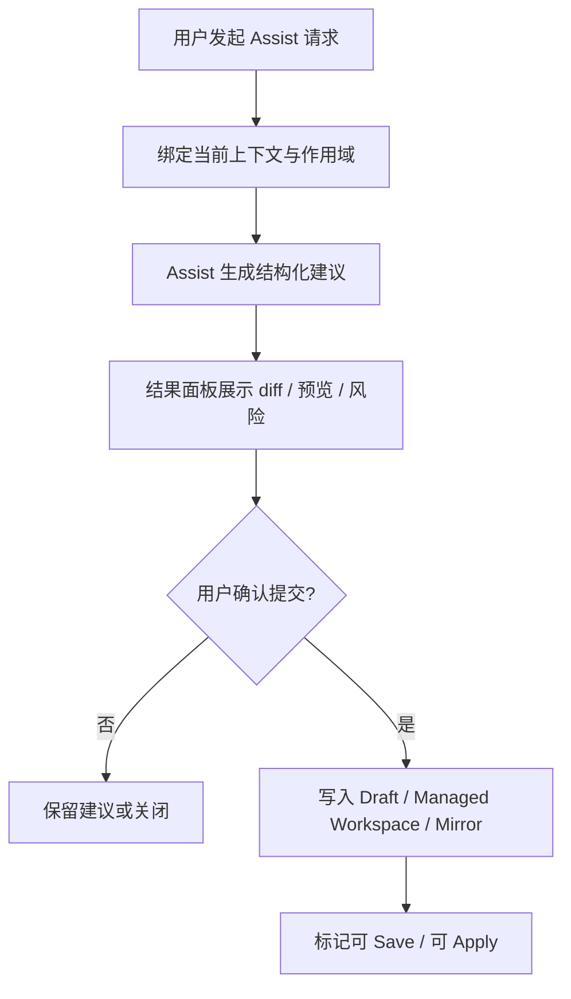

# OpenClaw 内置 Assist 全责 Agent 方案

日期：2026-03-23
状态：Draft for review

## 1. 文档目的

本文档用于固化 Multi-Agent-Flow 在完成 OpenClaw 内置后，引入统一 `Assist` 智能辅助能力的产品方案。

本文档回答 5 个问题：

- 用户应通过什么入口使用内置智能辅助
- Assist 在产品中的职责边界是什么
- Assist 应如何嵌入模板、配置、工作流和诊断场景
- Assist 的结果如何安全落到现有 Draft / Save / Apply 体系
- 后续实现应围绕哪些对象、状态和界面组织

本文档讨论的是产品设计与系统边界，不展开具体开发排期；执行顺序与里程碑见配套开发计划文档。

## 2. 背景与问题定义

当前工程已经具备以下基础条件：

- Workflow Editor 已明确收口为设计态界面
- 模板库、SOUL、受管 workspace、Apply 语义已经基本成型
- Workbench 已具备 `Chat / Run` 分流能力
- OpenClaw 交互层已开始引入 capability、attachment、session semantic 等概念

这意味着，产品已经不缺“接一个模型”的入口，而是需要一套可信、可控、可解释的智能辅助形态。

本方案要解决的不是单点按钮问题，而是 4 个系统性问题：

1. 软件内不同 AI 能力是否应该分散暴露
2. 模板、文案、布局、性能诊断是否应该由不同交互面承接
3. 智能修改如何不破坏当前设计态优先的产品语义
4. 用户如何理解“建议”“预览”“提交”“生效”之间的边界

## 3. 核心结论

本方案的核心结论只有一句话：

**用户只面对一个统一的 `Assist` 入口，系统内部由一个内置全责 agent 统一承接软件中的辅助任务，并以结构化结果落到设计态。**

这意味着：

- 不把产品表面拆成多个不同名字的小 AI
- 不把单独聊天窗口作为唯一主入口
- 不让自由对话直接越过设计态边界改动 runtime
- 不把 Assist 做成“万能自动执行器”

对应的产品定位是：

**Assist 不是运行态 orchestrator，也不是新的 workflow executor，而是设计态中的智能协作者。**

## 4. 设计原则

Assist 的设计必须严格遵循以下 8 条原则。

### 4.1 统一入口，内设全责 agent

用户只面对一个 `Assist` 入口；模板、文案、布局、性能、配置检查等问题，都由同一个内置全责 agent 统一承接，不要求用户理解系统内部职责拆分。

### 4.2 高频操作就近完成

文案修改、模板补全、节点整理等高频任务，应优先在当前编辑界面直接触发，而不是要求用户跳转到单独窗口。

### 4.3 聊天负责表达意图，结构化界面负责落地执行

聊天用于表达目标与约束；真正的改动必须通过 `diff`、预览、布局草案、表单或结构化结果完成，不能只停留在自由对话。

### 4.4 设计态优先，运行态隔离

内置 agent 默认只改 `draft / managed workspace / mirror`，不直接改 `live runtime`；所有改动继续遵循现有 `Draft -> Save -> Apply` 语义。

### 4.5 建议，预览，再提交

凡是会影响内容、布局、配置、生效结果的动作，先生成建议和预览，再由用户确认提交，避免系统擅自修改。

### 4.6 Assist 是“戴着手套、受限权限、每一步可回退的手”

Assist 可以帮助用户完成操作，但不应默认成为一只直接裸手操作软件的自动执行器。

它的正确形态是：

- 只在明确授权的范围内行动
- 只优先处理低风险、可解释、可撤销的动作
- 所有关键动作都保留人工确认
- 任何自动写入都必须具备回退点

换句话说，Assist 可以像“手”，但必须是一只戴着手套、权限受限、每一步都可回退的手。

### 4.7 最小作用域与最小权限

每次辅助都只绑定到当前选中文本、当前文件、当前节点或当前 workflow 之一；性能诊断默认只读，避免越权和误改。

### 4.8 全过程可解释、可追踪、可回退

每次辅助都保留任务来源、上下文、建议内容、执行结果和回退点，确保可审计、可复现、可撤销。

## 5. 产品定位与边界

### 5.1 Assist 负责什么

- 模板构建与补全
- SOUL / AGENTS / IDENTITY / USER / TOOLS 等受管文档修改建议
- 当前选中文本改写、压缩、扩展、统一术语
- 当前节点命名、职责边界、协作描述建议
- 当前 workflow 的布局整理、节点分组、结构重排建议
- 当前项目的配置检查、问题解释、修复建议
- 当前工作流或项目的效率优化建议
- 当前运行指标、日志、trace 的诊断性解释

### 5.2 Assist 不负责什么

- 不直接执行 workflow
- 不替代 OpenClaw 的运行态调度器
- 不直接修改 live runtime root
- 不跳过用户确认直接发布配置
- 不在没有明确作用域时执行跨项目批量改动
- 不把自由聊天结果直接视为可落地修改

### 5.3 Assist 与现有能力的关系

- 与 Workflow Editor 的关系：Assist 服务于设计态编辑，不替代编辑器
- 与 Workbench Chat 的关系：Assist 可以通过对话收集意图，但不等于普通聊天
- 与 Workbench Run 的关系：Assist 不承担工作流执行主路径
- 与 Apply 的关系：Assist 只准备设计态结果，Apply 仍是显式生效动作

## 6. 总体产品形态

### 6.1 一个统一入口

产品层面只暴露一个 `Assist` 入口。

推荐落位：

- Workbench 顶部模式切换增加 `Assist`
- 各编辑界面增加就近 `Assist` 触发按钮
- 所有 Assist 输出统一进入结构化结果面板

### 6.2 三种使用方式

虽然入口统一，但交互上保留 3 种使用方式：

1. 全局进入 `Assist`
2. 当前界面就近触发 `Assist`
3. 对已有 Assist 结果继续追问和二次修改

这三种方式都必须汇总到同一条 Assist 状态链路，而不是变成三套独立产品。

### 6.3 为什么不以独立聊天窗口为主

独立聊天窗口的问题在于：

- 当前编辑上下文容易丢失
- 需要频繁来回跳转
- 布局预览、差异确认、局部提交都不自然

因此，独立聊天窗口最多作为后续增强形态，不应成为 V1 的主路径。

## 7. 典型场景

### 7.1 模板与文档场景

典型需求包括：

- 为当前 agent 构建模板初稿
- 补全 SOUL 缺失章节
- 将当前描述改写成更专业、更统一的风格
- 把当前 SOUL 收敛为适合导出模板的版本

此类操作的默认作用域是：

- 当前选中文本
- 当前文件
- 当前模板草稿

### 7.2 工作流编辑场景

典型需求包括：

- 自动整理当前 workflow 布局
- 重新组织节点层级和边界
- 为当前选中节点生成更清晰的职责描述
- 分析为什么当前结构难以理解

此类操作的默认作用域是：

- 当前节点
- 当前选中节点集合
- 当前 workflow

### 7.3 配置检查与诊断场景

典型需求包括：

- 检查当前 agent 的受管配置是否完整
- 解释为什么当前 Apply 或 Sync 容易失败
- 分析哪些文件缺失、哪些边界不清晰
- 解释性能慢的可能原因

此类操作默认只读，只有在用户确认后才允许生成修复建议草稿。

## 8. 交互模型

### 8.1 Assist 的统一工作流

Assist 的统一交互链路固定为：

### 8.2 聊天与结果面板的职责分离

聊天区负责：

- 收集用户目标
- 补充约束
- 允许继续追问
- 解释建议背后的原因

结果面板负责：

- 展示结构化建议
- 展示差异
- 展示风险与影响范围
- 提交到草稿
- 撤销本次改动

### 8.3 默认作用域绑定规则

如果用户从不同入口发起 Assist，请求应自动绑定到最小上下文：

- 文本选择入口：当前选中文本
- 文件编辑入口：当前文件
- 节点操作入口：当前节点
- 画布工具栏入口：当前 workflow
- 诊断入口：当前项目或当前 workflow，但默认只读

## 9. 结果类型

Assist 产出的结果不应只是一段自然语言，而应统一成结构化 proposal。

### 9.1 文案类结果

- `replace_selection`
- `rewrite_file_section`
- `fill_missing_sections`
- `normalize_terminology`

### 9.2 布局类结果

- `layout_preview`
- `grouping_suggestion`
- `rename_suggestion`
- `edge_cleanup_plan`

### 9.3 诊断类结果

- `readonly_report`
- `issue_list`
- `repair_suggestion`
- `performance_hypothesis`

### 9.4 所有结果必须附带

- 作用域
- 变更摘要
- 风险说明
- 是否只读
- 是否需要用户确认
- 是否会影响后续 Save / Apply

## 10. 数据对象建议

为避免 Assist 落地时再次变成松散消息系统，建议引入以下一等对象。

### 10.1 `AssistRequest`

用于表达本次用户意图。

建议字段：

- `id`
- `source`
- `intent`
- `scopeType`
- `scopeRef`
- `prompt`
- `constraints`
- `requestedAction`

### 10.2 `AssistContextPack`

用于向 Assist 提供当前页面的结构化上下文。

建议字段：

- `projectID`
- `workflowID`
- `nodeID`
- `relativeFilePath`
- `selectedText`
- `currentDocumentText`
- `selectionRange`
- `layoutSnapshot`
- `runtimeHealthSnapshot`
- `attachmentState`

### 10.3 `AssistProposal`

用于表达结构化建议结果。

建议字段：

- `id`
- `requestID`
- `proposalType`
- `summary`
- `scopeType`
- `scopeRef`
- `readOnly`
- `changes`
- `preview`
- `warnings`
- `requiresConfirmation`

### 10.4 `AssistExecutionReceipt`

用于记录本次是否真正写入了设计态数据。

建议字段：

- `id`
- `proposalID`
- `appliedAt`
- `appliedTargets`
- `writtenFiles`
- `draftChanged`
- `mirrorChanged`
- `saveRequired`
- `applyRequired`
- `error`

### 10.5 `AssistUndoCheckpoint`

用于支持回退。

建议字段：

- `id`
- `receiptID`
- `scopeType`
- `scopeRef`
- `snapshotLocation`
- `createdAt`

## 11. 状态机建议

Assist 应具备独立状态机，而不是复用普通聊天状态。

建议状态：

- `idle`
- `collecting_context`
- `drafting_proposal`
- `awaiting_confirmation`
- `applying_to_draft`
- `applied`
- `failed`
- `reverted`

关键要求：

- `drafting_proposal` 与 `applying_to_draft` 必须分离
- `applied` 不等于 `saved`
- `saved` 不等于 `applied_to_runtime`
- 任意写入型 proposal 都必须先经过 `awaiting_confirmation`

## 12. 与现有系统的适配建议

### 12.1 Workbench

当前 Workbench 已有 `Chat / Run` 语义。

建议演进为：

- `Chat`
- `Assist`
- `Run`

其中：

- `Chat` 继续承载自治对话
- `Assist` 承载设计态辅助
- `Run` 承载受控运行

### 12.2 Session 语义

当前模型中已经存在：

- `conversation.autonomous`
- `conversation.assisted`
- `run.controlled`
- `inspection.readonly`

建议：

- `Assist` 主交互优先落在 `conversation.assisted`
- 只读诊断型 Assist 可落在 `inspection.readonly`

这样能尽量复用已有 session semantic，而不重新发明一套完全平行体系。

### 12.3 编辑器与文件系统

Assist 的写入型动作必须只触达：

- 当前编辑器 draft
- 当前 node-local managed workspace
- 当前 project mirror

不得直接写：

- live runtime root
- 外部任意文件系统路径
- 跨 agent 未授权文件

## 13. UI 设计建议

### 13.1 Workbench 顶部模式

建议将现有模式从：

- `Chat`
- `Run`

升级为：

- `Chat`
- `Assist`
- `Run`

### 13.2 编辑器内就近入口

在以下位置提供 Assist 快捷入口：

- 模板工作区
- 受管配置编辑区
- 节点属性面板
- Workflow Editor 工具栏

典型按钮文案建议：

- `Assist 改写`
- `Assist 补全`
- `Assist 检查`
- `Assist 整理布局`
- `Assist 解释问题`

### 13.3 Assist 结果面板

建议增加统一结果面板，承担以下职责：

- 展示建议摘要
- 展示差异或预览
- 展示风险说明
- 提供 `应用到草稿`
- 提供 `撤销本次改动`

## 14. 验收标准

本方案的产品验收必须至少满足以下标准：

1. 用户只需要理解一个 `Assist`，不需要理解多个内部 agent。
2. 高频编辑任务可以在当前界面触发，不被迫跳转独立窗口。
3. Assist 的任何写入动作都先有建议和预览。
4. Assist 写入后只影响设计态，不直接改 runtime。
5. 所有写入结果都能解释来源、作用域和影响范围。
6. 用户可以撤销本次 Assist 写入。
7. `Save / Apply` 的原有产品语义不被混淆。

## 15. 风险与约束

### 15.1 最大风险

最大的风险不是“做不出来”，而是做成一个边界模糊的万能入口。

一旦缺少作用域、预览和回退，Assist 很容易演变成：

- 到处都能改
- 改完用户不知道发生了什么
- 破坏当前设计态语义
- 为后续排错制造高成本

### 15.2 约束结论

因此必须坚持以下约束：

- 先作用域，后生成建议
- 先预览，后提交
- 先设计态写入，后 Save / Apply
- 先可解释，后自动化

## 16. 结论

OpenClaw 内置后的最佳产品形态，不是“再加一个聊天框”，也不是“做很多分散的小 AI”。

更合理的方向是：

**在现有设计态产品中引入统一的 `Assist` 入口，由一个内置全责 agent 统一承接模板、文案、布局、诊断等辅助任务，并以结构化、可确认、可回退的方式落到 Draft / Save / Apply 体系中。**

这一路径既能保持产品心智简单，也能最大程度复用当前项目已经形成的设计态与运行态边界。
