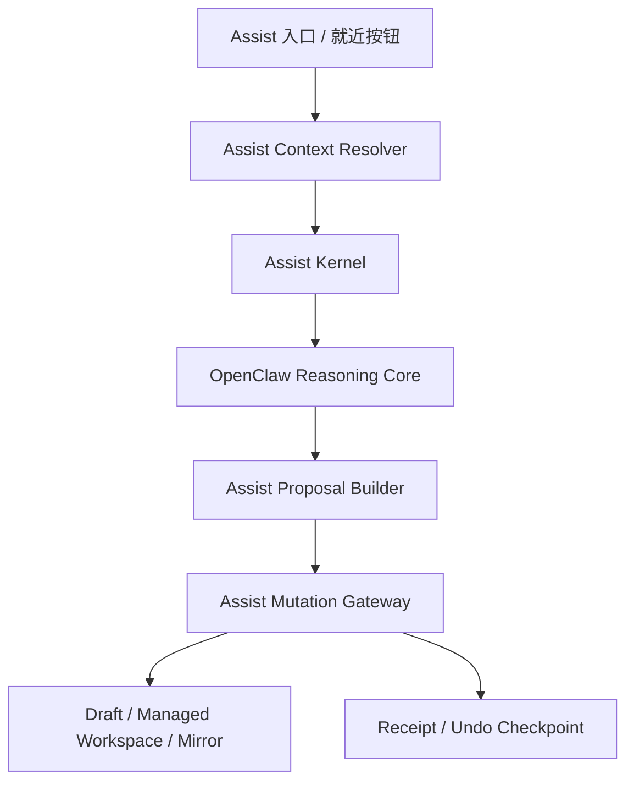
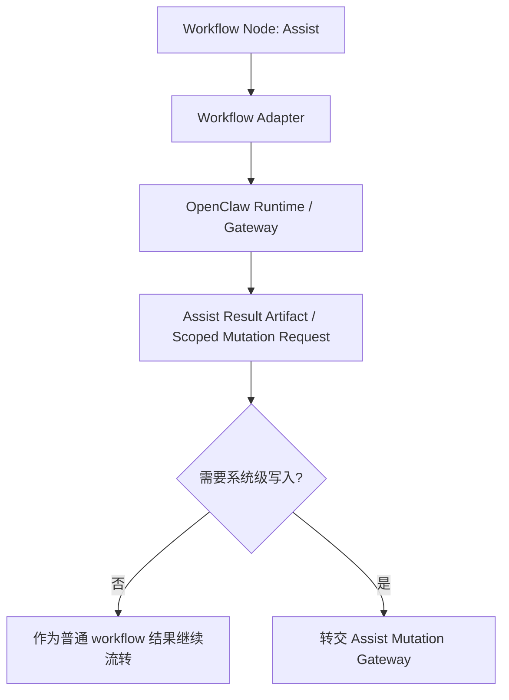
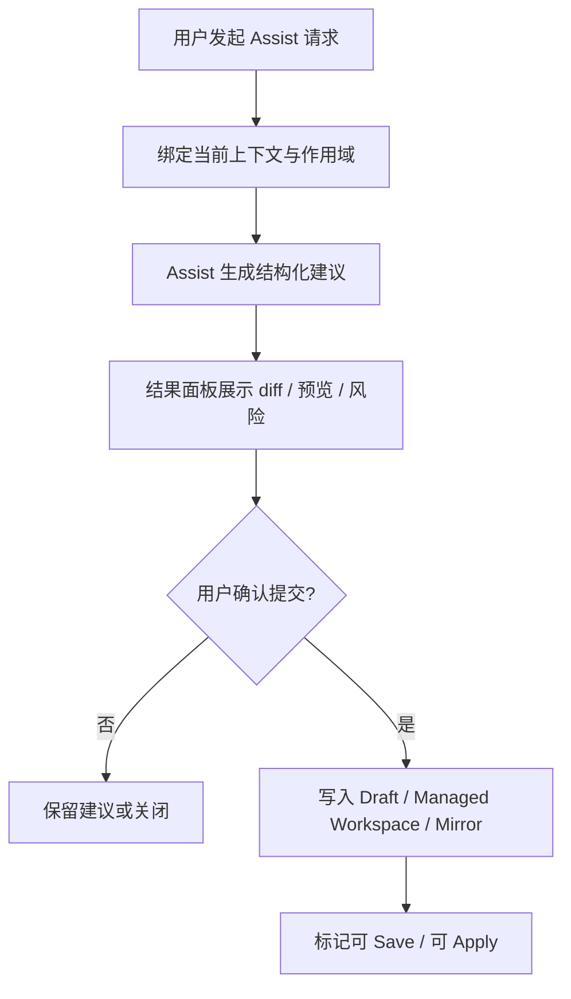

# OpenClaw 内置 Assist 全责 Agent 方案

日期：2026-03-23
更新：2026-03-24（按当前代码基线校正）
状态：Draft for review

## 1. 文档目的

本文档用于固化 Multi-Agent-Flow 在完成 OpenClaw 内置后，引入统一 `Assist` 智能辅助能力的产品方案。

本文档回答 5 个问题：

- 用户应通过什么入口使用内置智能辅助
- Assist 在产品中的职责边界是什么
- Assist 应如何嵌入模板、配置、工作流和诊断场景
- Assist 的结果如何安全落到现有 Draft / Save / Apply 体系
- 后续实现应围绕哪些对象、状态和界面组织

本文档讨论的是产品设计与系统边界，不展开具体开发排期；执行顺序与里程碑见配套开发计划文档。

## 2. 背景与问题定义

截至 2026-03-24，当前工程的真实代码基线如下：

- Workflow Editor、模板库、SOUL、受管 workspace、mirror、`Draft -> Save -> Apply` 主语义已经存在，可作为 Assist 的设计态落点
- Workbench 在 UI 上当前仍只有 `Chat / Run` 两态，`Assist` 还没有真正接入模式切换；这一点在 [MessagesView.swift](/Users/chenrongze/Desktop/MultiAgentOrchestrator/MultiAgentOrchestrator/Multi-Agent-Flow/Sources/Views/MessagesView.swift) 中已经很明确
- Session semantic 已经预埋 `conversation.assisted` 与 `inspection.readonly`，说明 Assist 的语义基础已经存在，不需要另起一套平行线程模型；对应实现见 [SessionSemantics.swift](/Users/chenrongze/Desktop/MultiAgentOrchestrator/MultiAgentOrchestrator/Multi-Agent-Flow/Sources/Models/SessionSemantics.swift)
- `MAProject.RuntimeState` 当前承载的是项目所属的 runtime / workbench 状态，例如 active run、thread state、dispatch queue、runtime events；因此 Assist 的全过程历史不应继续塞进这个结构，相关现状见 [MAProject.swift](/Users/chenrongze/Desktop/MultiAgentOrchestrator/MultiAgentOrchestrator/Multi-Agent-Flow/Sources/Models/MAProject.swift)
- 项目托管数据当前由 `ProjectFileSystem` 写入 `Application Support/Multi-Agent-Flow/Projects/...`，这是项目层目录，不适合承载跨项目的 Assist 历史
- 系统级模板库已经有明确先例：模板资产当前存放在 `Application Support/Multi-Agent-Flow/Libraries/Templates/...`；Assist Store 应沿用同层级系统库组织，而不是再开一个与 `Libraries` 平行的散乱根目录
- 当前代码库还没有完整的用户角色权限系统；现阶段只能先以系统内置策略、feature flag 或内部固定 grant 管理 Assist 的系统级能力，再为后续用户权限系统预留接管位

这意味着，产品已经不缺“接一个模型”的入口，而是需要一套可信、可控、可解释的智能辅助形态。

因此，本文以下所有描述都按“目标方案 + 当前基线约束”来书写，避免把尚未落地的能力误写成当前现实。

本方案要解决的不是单点按钮问题，而是 4 个系统性问题：

1. 软件内不同 AI 能力是否应该分散暴露
2. 模板、文案、布局、性能诊断是否应该由不同交互面承接
3. 智能修改如何不破坏当前设计态优先的产品语义
4. 用户如何理解“建议”“预览”“提交”“生效”之间的边界

## 3. 核心结论

本方案的核心结论只有一句话：

**用户只面对一个统一的 `Assist` 入口，但 `Assist` 的真正优势不是“像普通 agent 一样会聊天”，而是它作为 OpenClaw 内置后的系统级助手，拥有一条比非内置源 agent 更低损耗的架构调用路径。**

这意味着：

- 不把产品表面拆成多个不同名字的小 AI
- 不把单独聊天窗口作为唯一主入口
- 不让自由对话直接越过设计态边界改动 runtime
- 不把 Assist 做成“万能自动执行器”

对应的产品定位是：

**Assist 不是单纯的业务 agent，也不是新的 workflow 主控制器，而是带有系统级控制面能力的内置智能助手。**

### 3.1 为什么内置 Assist 比非内置源 agent 更强

Assist 的核心优势，不应主要建立在“模型更强”上，而应建立在“调用路径更短、损耗更低、回写更稳定”上。

对比普通非内置 OpenClaw 源 agent，Assist 多出的不是抽象智能，而是系统级通路：

- 它可以直接读取当前 UI 的结构化上下文，而不必先把上下文压扁成 prompt
- 它可以返回结构化 proposal，而不必先输出自然语言再让系统反向猜测意图
- 它可以通过受控 mutation gateway 写入 draft / mirror，而不必绕到通用运行态再回写
- 它可以天然挂接 receipt / undo / scope，而不是事后补救

因此，Assist 的系统级价值主要体现在 5 种“损耗”被显著降低：

- 上下文损耗：当前选区、当前节点、当前布局、当前状态不需要反复转成文本
- 语义损耗：不依赖“从聊天文本里猜修改动作”
- 路径损耗：不必经过完整 runtime 编排后再回到本地设计态
- 安全损耗：作用域、确认、回退在调用链路里天然存在
- 延迟损耗：本地设计态操作不需要先走一圈外部执行面

### 3.2 低损耗路径的设计结论

基于这一点，Assist 不能被设计成“只是一个特殊名字的普通 agent”。

更合理的设计应是：

- 对外：`Assist` 仍然是一个统一身份
- 对内：`Assist` 具备两条不同调用通道
- 优势来源：系统内置通道比普通源 agent 通道更低损耗

这意味着，方案重心不应只放在“入口统一”，还必须放在“控制面路径独立”。

## 4. 设计原则

Assist 的设计必须严格遵循以下 9 条原则。

### 4.1 统一入口，内设全责 agent

用户只面对一个 `Assist` 入口；模板、文案、布局、性能、配置检查等问题，都由同一个内置全责 agent 统一承接，不要求用户理解系统内部职责拆分。

### 4.2 高频操作就近完成

文案修改、模板补全、节点整理等高频任务，应优先在当前编辑界面直接触发，而不是要求用户跳转到单独窗口。

### 4.3 聊天负责表达意图，结构化界面负责落地执行

聊天用于表达目标与约束；真正的改动必须通过 `diff`、预览、布局草案、表单或结构化结果完成，不能只停留在自由对话。

### 4.4 设计态优先，运行态隔离

内置 agent 默认只改 `draft / managed workspace / mirror`，不直接改 `live runtime`；所有改动继续遵循现有 `Draft -> Save -> Apply` 语义。

### 4.5 建议，预览，再提交

凡是会影响内容、布局、配置、生效结果的动作，先生成建议和预览，再由用户确认提交，避免系统擅自修改。

### 4.6 Assist 是“戴着手套、受限权限、每一步可回退的手”

Assist 可以帮助用户完成操作，但不应默认成为一只直接裸手操作软件的自动执行器。

它的正确形态是：

- 只在明确授权的范围内行动
- 只优先处理低风险、可解释、可撤销的动作
- 所有关键动作都保留人工确认
- 任何自动写入都必须具备回退点

换句话说，Assist 可以像“手”，但必须是一只戴着手套、权限受限、每一步都可回退的手。

### 4.7 最小作用域与最小权限

每次辅助都只绑定到当前选中文本、当前文件、当前节点或当前 workflow 之一；性能诊断默认只读，避免越权和误改。

### 4.8 全过程可解释、可追踪、可回退

每次辅助都保留任务来源、上下文、建议内容、执行结果和回退点，确保可审计、可复现、可撤销。

### 4.9 Assist 是跨项目存在，其运行数据归属系统层

Assist 是软件内置后的系统级助手，而不是某个项目私有的 agent 实例。

因此必须坚持：

- Assist 的 request / context / proposal / receipt / undo 等运行数据，默认归属系统层
- 这些数据不应写入 `.maoproj` 或项目托管数据目录
- 项目中只保留被确认后的结果性改动，而不保留 Assist 的全过程运行记录
- 如果需要把某次 Assist 结果纳入项目交付物，必须经过显式导出或固化，而不是默认混入项目数据

## 5. 产品定位与边界

### 5.1 Assist 负责什么

- 模板构建与补全
- SOUL / AGENTS / IDENTITY / USER / TOOLS 等受管文档修改建议
- 当前选中文本改写、压缩、扩展、统一术语
- 当前节点命名、职责边界、协作描述建议
- 当前 workflow 的布局整理、节点分组、结构重排建议
- 当前项目的配置检查、问题解释、修复建议
- 当前工作流或项目的效率优化建议
- 当前运行指标、日志、trace 的诊断性解释

### 5.2 Assist 不负责什么

- 不替代 OpenClaw 的运行态调度器
- 不承担 workflow 的全局主控制器职责
- 不直接修改 live runtime root
- 不跳过用户确认直接发布配置
- 不在没有明确作用域时执行跨项目批量改动
- 不把自由聊天结果直接视为可落地修改

### 5.3 Assist 的组织边界

Assist 在产品组织上应明确区别于普通业务 agent。

边界建议如下：

- Assist 属于模板体系，但它是系统模板，不是普通业务模板
- 普通用户不能像配置业务 agent 一样任意配置 Assist
- Assist 的系统模板与运行数据应采用系统库方式管理，优先复用现有 `Libraries/*` 的组织模式
- Assist 的模板、能力、权限边界应由系统内置；在当前尚无完整用户权限系统时，V1 应先由内置策略或 feature flag 控制，并为后续用户权限系统预留控制位
- Assist 可以被放入 workflow 中作为普通节点调用
- 但即使作为 workflow 节点存在，它也不自动继承系统级写入权限

### 5.4 Assist 的执行边界

Assist 的“系统级改动能力”和“普通 agent 对话能力”必须严格分开。

必须坚持以下规则：

- Assist 无法通过“普通聊天 agent”的方式直接完成系统级改动
- 任何系统级改动都必须经过 Assist 的系统通道
- workflow 中调用的 Assist 节点，可以输出建议、诊断、结构化产物
- 若 workflow 中的 Assist 节点需要触发系统级写入，必须再经过显式 scope 校验、权限校验和 mutation gateway

换句话说：

- `Assist as Chat Agent` 不等于 `Assist as System Assistant`
- `Assist as Workflow Node` 也不等于天然拥有系统级控制权

### 5.5 Assist 与现有能力的关系

- 与 Workflow Editor 的关系：Assist 服务于设计态编辑，不替代编辑器
- 与 Workbench Chat 的关系：Assist 可以通过对话收集意图，但系统级改动不走普通聊天 agent 模式
- 与 Workbench Run 的关系：Assist 可以作为 workflow 节点被调用，但不承担工作流执行主路径
- 与 Apply 的关系：Assist 只准备设计态结果，Apply 仍是显式生效动作
- 与项目归档的关系：项目保存的是最终设计结果，不默认保存 Assist 的运行历史

## 6. 总体产品形态

### 6.1 一个统一入口，两个调用通道

产品层面只暴露一个 `Assist` 入口。

截至 2026-03-24，这仍是目标演进形态而非现状，因为当前 Workbench 还只有 `Chat / Run` 两态。

推荐落位：

- Workbench 顶部模式切换增加 `Assist`
- 各编辑界面增加就近 `Assist` 触发按钮
- 所有 Assist 输出统一进入结构化结果面板

但底层必须明确拆成两条通道：

1. 系统内置通道
2. workflow 适配通道

### 6.2 系统内置通道：低损耗控制面路径

系统内置通道是 Assist 真正的核心优势所在。

它的链路应为：



这条路径的特点是：

- 上下文是 typed context，不是 prompt 拼装后的残损文本
- 输出是 typed proposal，不是需要二次解析的自然语言
- 写入走 mutation gateway，不走普通运行态回写
- receipt 和 undo 是主路径产物，不是附属功能

### 6.3 Workflow 适配通道：可调用，但不是默认低损耗主路径

Assist 也可以作为 workflow 节点存在，用于：

- 诊断
- 结构分析
- 生成建议
- 产出中间工件
- 参与更复杂的多节点协作

但这条路径不应被误认为等于系统通道。

它的链路应为：



也就是说：

- workflow 中的 Assist 节点可以被调用
- 但系统级改动仍必须回到系统级 mutation gateway
- workflow 适配通道主要解决“可组合性”
- 系统内置通道主要解决“低损耗与高可信”

### 6.4 三种使用方式

虽然入口统一，但交互上保留 3 种使用方式：

1. 全局进入 `Assist`
2. 当前界面就近触发 `Assist`
3. 在 workflow 中调用 `Assist` 节点

其中前两种默认优先走系统内置通道，第三种走 workflow 适配通道。

### 6.5 为什么不以独立聊天窗口为主

独立聊天窗口的问题在于：

- 当前编辑上下文容易丢失
- 需要频繁来回跳转
- 布局预览、差异确认、局部提交都不自然

因此，独立聊天窗口最多作为后续增强形态，不应成为 V1 的主路径。

## 7. 典型场景

### 7.1 模板与文档场景

典型需求包括：

- 为当前 agent 构建模板初稿
- 补全 SOUL 缺失章节
- 将当前描述改写成更专业、更统一的风格
- 把当前 SOUL 收敛为适合导出模板的版本

此类操作的默认作用域是：

- 当前选中文本
- 当前文件
- 当前模板草稿

### 7.2 工作流编辑场景

典型需求包括：

- 自动整理当前 workflow 布局
- 重新组织节点层级和边界
- 为当前选中节点生成更清晰的职责描述
- 分析为什么当前结构难以理解

此类操作的默认作用域是：

- 当前节点
- 当前选中节点集合
- 当前 workflow

### 7.3 配置检查与诊断场景

典型需求包括：

- 检查当前 agent 的受管配置是否完整
- 解释为什么当前 Apply 或 Sync 容易失败
- 分析哪些文件缺失、哪些边界不清晰
- 解释性能慢的可能原因

此类操作默认只读，只有在用户确认后才允许生成修复建议草稿。

## 8. 交互模型

### 8.1 系统通道下的 Assist 工作流

系统通道下的 Assist 交互链路固定为：



### 8.2 Workflow 通道下的 Assist 工作流

当 Assist 被作为 workflow 节点调用时，推荐链路为：

1. workflow 调度到 Assist 节点
2. Assist 节点读取当前 workflow 上下文
3. 输出建议、诊断报告或结构化产物
4. 若只是普通结果，则继续沿 workflow 流转
5. 若需要系统级改动，则转交 mutation gateway 做二次确认

### 8.3 聊天与结果面板的职责分离

聊天区负责：

- 收集用户目标
- 补充约束
- 允许继续追问
- 解释建议背后的原因

结果面板负责：

- 展示结构化建议
- 展示差异
- 展示风险与影响范围
- 提交到草稿
- 撤销本次改动

### 8.4 默认作用域绑定规则

如果用户从不同入口发起 Assist，请求应自动绑定到最小上下文：

- 文本选择入口：当前选中文本
- 文件编辑入口：当前文件
- 节点操作入口：当前节点
- 画布工具栏入口：当前 workflow
- 诊断入口：当前项目或当前 workflow，但默认只读

### 8.5 哪些动作必须经过 mutation gateway

以下动作即使由 Assist 发起，也必须经过 mutation gateway：

- 写入当前 draft
- 写入 node-local managed workspace
- 写入 project mirror
- 对 workflow 结构做确认后的重排
- 任何可能影响后续 Save / Apply 状态的动作

普通聊天消息、普通 workflow 输出、普通自然语言建议，不应直接越过这层。

### 8.6 Assist 数据与项目数据的分离原则

Assist 的一次完整调用，会产生两类不同性质的数据：

1. Assist 运行数据
2. 项目结果数据

两者必须分离。

Assist 运行数据包括：

- request
- context
- proposal
- receipt
- undo checkpoint
- 诊断报告
- 中间工件

这些数据的默认归属是系统层，不进入项目数据。

项目结果数据包括：

- 被确认后写入 draft 的文本结果
- 被确认后写入 managed workspace 的文件结果
- 被确认后写入 mirror 的结构结果

这些数据才属于项目。

也就是说：

- Assist 负责生成和管理“为什么这样改”
- 项目负责承载“最后改成了什么”

## 9. 结果类型

Assist 产出的结果不应只是一段自然语言，而应统一成结构化 proposal。

### 9.1 文案类结果

- `replace_selection`
- `rewrite_file_section`
- `fill_missing_sections`
- `normalize_terminology`

### 9.2 布局类结果

- `layout_preview`
- `grouping_suggestion`
- `rename_suggestion`
- `edge_cleanup_plan`

### 9.3 诊断类结果

- `readonly_report`
- `issue_list`
- `repair_suggestion`
- `performance_hypothesis`

### 9.4 所有结果必须附带

- 作用域
- 变更摘要
- 风险说明
- 是否只读
- 是否需要用户确认
- 是否会影响后续 Save / Apply

## 10. 数据对象建议

为避免 Assist 落地时再次变成松散消息系统，建议引入以下一等对象。

### 10.1 `AssistRequest`

用于表达本次用户意图。

建议字段：

- `id`
- `source`
- `intent`
- `scopeType`
- `scopeRef`
- `prompt`
- `constraints`
- `requestedAction`

### 10.2 `AssistContextPack`

用于向 Assist 提供当前页面的结构化上下文。

建议字段：

- `projectID`
- `workflowID`
- `nodeID`
- `relativeFilePath`
- `selectedText`
- `currentDocumentText`
- `selectionRange`
- `layoutSnapshot`
- `runtimeHealthSnapshot`
- `attachmentState`
- `invocationChannel`

### 10.3 `AssistProposal`

用于表达结构化建议结果。

建议字段：

- `id`
- `requestID`
- `proposalType`
- `summary`
- `scopeType`
- `scopeRef`
- `readOnly`
- `changes`
- `preview`
- `warnings`
- `requiresConfirmation`
- `requiresMutationGateway`

### 10.4 `AssistExecutionReceipt`

用于记录本次是否真正写入了设计态数据。

建议字段：

- `id`
- `proposalID`
- `appliedAt`
- `appliedTargets`
- `writtenFiles`
- `draftChanged`
- `mirrorChanged`
- `saveRequired`
- `applyRequired`
- `error`

注意：

- `projectID`、`workflowID`、`nodeID` 仅用于建立引用关系
- 它们不代表这些对象拥有 Assist 数据本身
- receipt 的归属仍然是 Assist 系统层存储

### 10.5 `AssistCapabilityGrant`

用于表达 Assist 当前是否具备某类系统级动作授权。

建议字段：

- `id`
- `grantType`
- `scopeType`
- `scopeRef`
- `grantedBy`
- `expiresAt`

### 10.6 `AssistUndoCheckpoint`

用于支持回退。

建议字段：

- `id`
- `receiptID`
- `scopeType`
- `scopeRef`
- `snapshotLocation`
- `createdAt`

### 10.7 `AssistMutationGateway`

用于统一处理系统级设计态写入。

职责包括：

- 校验作用域
- 校验权限
- 校验是否需要人工确认
- 执行写入
- 生成 receipt
- 建立 undo checkpoint

关键边界：

- gateway 可以写项目结果
- 但 gateway 自身产生的记录仍存放在系统层 Assist Store

## 11. Assist 数据管理方案

### 11.1 核心结论

Assist 是跨项目的系统级存在，因此其数据管理不能采用“写进项目数据”的方式。

正确方案应是：

- Assist 数据统一存于系统级 Assist Store
- 项目只接收确认后的最终变更结果
- 项目与 Assist 之间通过引用关系关联，而不是通过所有权绑定

### 11.2 数据归属分层

建议将数据归属拆为 3 层：

1. 系统配置层
2. 系统运行层
3. 项目结果层

系统配置层包括：

- Assist 系统模板
- 能力声明
- 权限策略
- 版本信息

系统运行层包括：

- AssistRequest
- AssistContextPack
- AssistProposal
- AssistExecutionReceipt
- AssistCapabilityGrant
- AssistUndoCheckpoint
- AssistArtifact
- AssistThread

项目结果层只包括：

- 被确认写入 draft 的结果
- 被确认写入 managed workspace 的结果
- 被确认写入 mirror 的结果

### 11.3 存储位置建议

不建议将 Assist 数据写入：

- `.maoproj`
- `design/`
- 项目托管目录中的 Assist 子目录

建议统一写入应用级系统目录，例如：

```text
Application Support/
  Multi-Agent-Flow/
    Libraries/
      Assist/
        system-template/
        grants/
        requests/
        contexts/
        proposals/
        receipts/
        undo/
        artifacts/
        threads/
        indexes/
```

其中：

- 主记录放系统目录
- index 负责按 `projectID / workflowID / nodeID / threadID` 建立查询关系
- 该路径应与现有 `Libraries/Templates` 保持同一系统库层级，而不要写入 `Projects/...` 或另起顶层 `Assist/...`

### 11.4 项目与 Assist 的关系模型

项目不拥有 Assist 数据，但可以被 Assist 数据引用。

推荐关系模型：

- AssistRequest 持有 `projectID`
- AssistProposal 持有 `projectID / workflowID / nodeID / relativeFilePath`
- AssistExecutionReceipt 持有写入目标引用
- 项目本身不反向持有完整 Assist 记录

如确有需要，项目中最多只保留轻量级外键或最近一次 mutation token，而不保留完整 Assist 历史。

### 11.5 Undo 如何处理

Undo 数据也不应默认保存在项目目录中。

推荐做法：

- undo checkpoint 保存在系统级 Assist Store
- checkpoint 内部保存 patch、snapshot ref 或内容哈希
- 执行回退时，再通过 mutation gateway 回写目标项目

这样可以保证：

- Assist 可跨项目统一管理回退能力
- 项目导出时不会把大量 Assist 中间数据一并导出
- 项目数据保持干净

### 11.6 导入导出策略

由于 Assist 是跨项目系统存在，默认导入导出策略建议如下：

- 导出项目时，不默认导出 Assist 历史
- 导入项目时，不要求恢复原 Assist 历史
- 如需保留特定 Assist 诊断或建议，必须显式导出为 artifact

这意味着：

- 项目文件负责交付项目
- Assist Store 负责保留系统级辅助历史

### 11.7 查询与索引策略

虽然 Assist 数据不在项目里，但系统仍要支持按项目查询。

建议系统级索引至少支持：

- 按 `projectID` 查询
- 按 `workflowID` 查询
- 按 `nodeID` 查询
- 按 `relativeFilePath` 查询
- 按 `threadID` 查询
- 按 `proposalType` 查询
- 按时间范围查询

这样可以做到：

- 数据归属在系统层
- 查询视图可以按项目过滤

### 11.8 数据生命周期建议

建议区分长期保留和可清理数据。

长期保留：

- 已确认 proposal
- execution receipt
- undo checkpoint
- 关键诊断 artifact

短期缓存：

- 未确认 proposal
- 中间流式输出
- 临时上下文拼装结果

这样既能保留审计能力，也不会让系统数据无限膨胀。

详细的数据落盘、索引、生命周期和恢复策略见：

- [openclaw-assist-store-design-zh-2026-03-23.md](/Users/chenrongze/Desktop/MultiAgentOrchestrator/MultiAgentOrchestrator/Multi-Agent-Flow/Documentation/openclaw-assist-store-design-zh-2026-03-23.md)

## 12. 状态机建议

Assist 应具备独立状态机，而不是复用普通聊天状态。

建议状态：

- `idle`
- `collecting_context`
- `drafting_proposal`
- `awaiting_confirmation`
- `applying_to_draft`
- `applied`
- `failed`
- `reverted`

关键要求：

- `drafting_proposal` 与 `applying_to_draft` 必须分离
- `applied` 不等于 `saved`
- `saved` 不等于 `applied_to_runtime`
- 任意写入型 proposal 都必须先经过 `awaiting_confirmation`
- 任意系统级写入都必须经过 mutation gateway

## 13. 与现有系统的适配建议

### 13.1 Workbench

当前 Workbench 已有 `Chat / Run` 语义，并且在代码实现上也仍只有这两种交互模式。

这意味着：

- `Assist` 模式是下一步显式演进项，而不是已经存在但尚未命名的隐藏模式
- 本文所有关于 `Workbench Assist` 的描述都应理解为“基于现有 `Chat / Run` 结构扩展出的第三态”

建议演进为：

- `Chat`
- `Assist`
- `Run`

其中：

- `Chat` 继续承载自治对话
- `Assist` 承载系统级低损耗辅助
- `Run` 承载受控运行

### 13.2 Session 语义

当前模型中已经存在：

- `conversation.autonomous`
- `conversation.assisted`
- `run.controlled`
- `inspection.readonly`

建议：

- `Assist` 主交互优先落在 `conversation.assisted`
- 只读诊断型 Assist 可落在 `inspection.readonly`
- workflow 中的 Assist 节点执行可落在 `run.controlled`

这样能尽量复用已有 session semantic，而不重新发明一套完全平行体系。

### 13.3 模板体系

Assist 应被放入模板体系，但以“系统模板”身份存在。

这项设计和当前代码基线是相容的，因为模板库已经有系统级存储先例：现有模板资产通过 `AgentTemplateLibraryStore + TemplateFileSystem` 写入 `Application Support/Multi-Agent-Flow/Libraries/Templates/...`。

建议规则：

- 它有模板身份，便于版本化、描述能力边界、参与 workflow 选型
- 它不同于普通业务模板，普通用户不可直接自由配置
- V1 先使用系统内置策略或 feature flag 控制谁能查看、调用和触发系统级写入
- 未来再由用户权限系统控制谁能查看、调用、扩展其能力边界

### 13.4 编辑器与文件系统

Assist 的写入型动作必须只触达：

- 当前编辑器 draft
- 当前 node-local managed workspace
- 当前 project mirror

不得直接写：

- live runtime root
- 外部任意文件系统路径
- 跨 agent 未授权文件

同时必须明确：

- Assist 运行数据不进入项目文件系统
- 编辑器只消费 Assist proposal 结果，不持有其完整运行历史
- 当前 `MAProject.RuntimeState` 与 `ProjectFileSystem` 都属于项目层实现，Assist 历史不能继续并入这些 project-owned 结构

### 13.5 权限基线

当前代码中已经存在 `Permission` 模型，但它表达的是项目内 agent 到 agent 的通信权限，不等于“谁可以调用系统级 Assist、谁可以触发系统级写入”的用户权限系统。

因此建议：

- 不直接复用项目 `Permission` 模型承载 Assist 的系统级授权
- V1 先使用系统内置策略、feature flag 或内部固定 grant
- 等真正的用户系统与角色权限体系落地后，再把 Assist 的调用权与写入权接入统一权限层

## 14. UI 设计建议

### 14.1 Workbench 顶部模式

建议将现有模式从：

- `Chat`
- `Run`

升级为：

- `Chat`
- `Assist`
- `Run`

### 14.2 编辑器内就近入口

在以下位置提供 Assist 快捷入口：

- 模板工作区
- 受管配置编辑区
- 节点属性面板
- Workflow Editor 工具栏

典型按钮文案建议：

- `Assist 改写`
- `Assist 补全`
- `Assist 检查`
- `Assist 整理布局`
- `Assist 解释问题`

### 14.3 Assist 结果面板

建议增加统一结果面板，承担以下职责：

- 展示建议摘要
- 展示差异或预览
- 展示风险说明
- 提供 `应用到草稿`
- 提供 `撤销本次改动`

## 15. 验收标准

本方案的产品验收必须至少满足以下标准：

1. 用户只需要理解一个 `Assist`，不需要理解多个内部 agent。
2. 高频编辑任务可以在当前界面触发，不被迫跳转独立窗口。
3. Assist 的任何写入动作都先有建议和预览。
4. Assist 写入后只影响设计态，不直接改 runtime。
5. 所有写入结果都能解释来源、作用域和影响范围。
6. 用户可以撤销本次 Assist 写入。
7. `Save / Apply` 的原有产品语义不被混淆。
8. workflow 中可以调用 Assist 节点，但其系统级写入仍需经过 mutation gateway。
9. 普通聊天 agent 通道不能直接触发系统级改动。
10. 内置系统通道在上下文保真、回退和延迟上明显优于非内置源 agent 路径。
11. Assist 的运行数据默认不进入项目数据，项目导出不混入 Assist 历史。

## 16. 风险与约束

### 16.1 最大风险

最大的风险不是“做不出来”，而是做成一个边界模糊的万能入口。

一旦缺少作用域、预览和回退，Assist 很容易演变成：

- 到处都能改
- 改完用户不知道发生了什么
- 破坏当前设计态语义
- 为后续排错制造高成本

另一类重要风险是把 Assist 错误地实现成“只是一个普通源 agent 的内置别名”。

如果这样做，会出现：

- 仍然要把上下文压扁成文本
- 仍然要从自然语言中回推系统改动
- 仍然缺少稳定的 receipt / undo 主路径
- 无法体现内置后的低损耗优势

### 16.2 新的数据归属风险

如果错误地把 Assist 数据写入项目数据，会带来以下问题：

- `.maoproj` 体积快速膨胀
- 项目导入导出混入大量无关运行历史
- 跨项目的 Assist 无法形成统一记忆与审计视图
- 权限和生命周期管理被错误地绑定到单个项目

### 16.3 约束结论

因此必须坚持以下约束：

- 先作用域，后生成建议
- 先预览，后提交
- 先设计态写入，后 Save / Apply
- 系统级写入先经过 mutation gateway
- Assist 数据先进入系统级 Assist Store，再由 gateway 影响项目结果
- 先可解释，后自动化

## 17. 结论

OpenClaw 内置后的最佳产品形态，不是“再加一个聊天框”，也不是“做很多分散的小 AI”，更不是“把一个普通源 agent 直接塞进软件”。

更合理的方向是：

**在现有产品中引入统一的 `Assist` 入口，并把它设计成一个拥有低损耗系统通道的内置全责 agent：它可以进入模板体系、可以作为 workflow 节点调用，但系统级改动只能通过内置控制面路径和 mutation gateway 完成。**

这一路径既能保持产品心智简单，也能真正体现 OpenClaw 内置后的系统级优势，而不是把内置能力浪费成另一种普通 agent 壳层。
