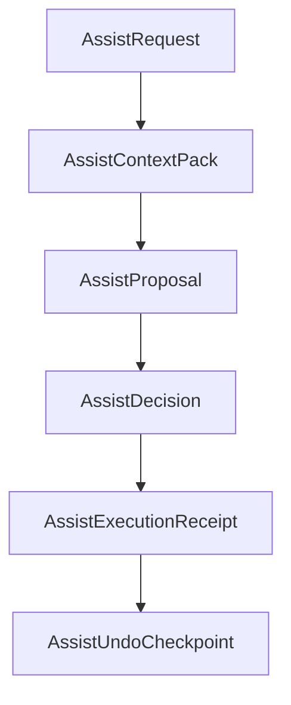

# OpenClaw Assist Store 数据设计

日期：2026-03-23
更新：2026-03-24（按当前代码基线校正）
状态：Draft for review

## 1. 文档目的

本文档用于细化 `Assist` 的数据管理方案，回答以下问题：

- Assist 作为跨项目系统级助手，其数据应归属哪里
- Assist 的 request / context / proposal / receipt / undo 如何组织
- 项目结果与 Assist 运行数据如何分离
- 系统级存储的目录结构、索引、生命周期和恢复策略应如何设计
- 后续实现 `AssistStore` 时，应采用什么样的工程约束

本文档是以下两份方案文档的配套细化：

- [openclaw-assist-agent-design-zh-2026-03-23.md](/Users/chenrongze/Desktop/MultiAgentOrchestrator/MultiAgentOrchestrator/Multi-Agent-Flow/Documentation/openclaw-assist-agent-design-zh-2026-03-23.md)
- [openclaw-assist-agent-full-cycle-plan-zh-2026-03-23.md](/Users/chenrongze/Desktop/MultiAgentOrchestrator/MultiAgentOrchestrator/Multi-Agent-Flow/Documentation/openclaw-assist-agent-full-cycle-plan-zh-2026-03-23.md)

## 2. 核心结论

Assist 是跨项目的系统级存在，因此其运行数据不能按“项目内功能数据”设计。

正确结论是：

- Assist 数据的所有权归系统层
- 项目只接收经过确认后的结果性修改
- Assist 与项目之间通过引用关系连接，而不是通过项目数据持有完整历史

换句话说：

- 项目负责保存“最后改成了什么”
- Assist Store 负责保存“为什么这样改、怎么改、能否回退”

### 2.1 当前代码基线（截至 2026-03-24）

当前代码里已经存在几条会直接影响 Assist Store 设计的工程事实：

- 系统级根目录已经统一由 `ProjectManager.shared.appSupportRootDirectory` 提供
- 项目托管数据当前由 `ProjectFileSystem` 写入 `Application Support/Multi-Agent-Flow/Projects/...`，这是项目层目录，不适合承载跨项目 Assist 数据
- 系统模板库已经通过 `AgentTemplateLibraryStore + TemplateFileSystem` 写入 `Application Support/Multi-Agent-Flow/Libraries/Templates/...`
- `MAProject.RuntimeState` 当前已经承载 project-owned 的 runtime / workbench / thread 状态，因此不应继续塞入 Assist 全过程历史
- 当前并不存在完整的用户角色权限系统；现有 `Permission` 更偏向项目内 agent-to-agent 权限，而不是系统级 Assist 授权

因此，本文件以下所有存储设计都按这条原则展开：

- Assist Store 应落在 `Libraries/Assist`
- Assist Store 不应写入 `Projects/...`
- Assist Store 不应并入 `RuntimeState`

## 3. 总体设计原则

Assist Store 的数据设计必须遵循以下原则。

### 3.1 系统所有权

`AssistRequest / AssistContextPack / AssistProposal / AssistExecutionReceipt / AssistUndoCheckpoint` 的默认所有权属于系统层，而不属于某个项目。

### 3.2 引用优先，不重复复制

除回退和关键审计需要的快照外，优先保存：

- 项目引用
- workflow 引用
- node 引用
- 文件引用
- 内容哈希

而不是对整个项目状态做重复拷贝。

### 3.3 结果进入项目，过程留在系统

只有经过确认并成功落写的结果，才进入项目。

Assist 的运行过程，包括：

- 请求
- 上下文
- 建议
- 回执
- 回退点

都留在系统级 Store 中。

### 3.4 事件链完整，查询路径清晰

任一次 Assist 调用，都应能够通过结构化链路追溯：

`request -> context -> proposal -> decision -> receipt -> undo`

### 3.5 可清理，但不可失真

Assist Store 允许做分层清理和压缩，但不能破坏：

- 审计链路
- 回退链路
- 跨项目查询能力

## 4. 数据归属模型

建议将 Assist 相关数据明确拆成 3 层。

### 4.1 系统配置层

系统配置层保存不依赖单个项目的稳定定义：

- Assist 系统模板
- 能力声明
- schema 版本
- 默认权限策略
- 运行参数

### 4.2 系统运行层

系统运行层保存 Assist 的全过程记录：

- AssistRequest
- AssistContextPack
- AssistProposal
- AssistDecision
- AssistExecutionReceipt
- AssistUndoCheckpoint
- AssistCapabilityGrant
- AssistArtifact
- AssistThread
- AssistIndex

### 4.3 项目结果层

项目结果层只保存被确认并写入项目的数据：

- draft 文本结果
- managed workspace 文件结果
- mirror 结构结果
- Save / Apply 状态变化

注意：

- 项目结果层不保存 Assist 历史
- 项目结果层不拥有 proposal / receipt / undo 的所有权
- 当前项目中的 `activeWorkbenchRuns / workbenchThreadStates / runtimeEvents` 等 runtime 字段仍然属于项目层，与 Assist Store 是并行关系而不是包含关系

## 5. 存储位置建议

### 5.1 根目录

建议将 Assist Store 存在系统级应用支持目录：

```text
Application Support/
  Multi-Agent-Flow/
    Libraries/
      Assist/
```

这样设计的原因是：

- 它与现有 `Libraries/Templates` 处在同一系统库层级，符合当前代码中的系统资产组织习惯
- 它明确表达 Assist 是跨项目系统资产，而不是项目附属目录
- 它避免在 `Multi-Agent-Flow` 根下继续堆平铺型目录，降低后续系统库扩展的混乱度

不要将其放进：

- `.maoproj`
- 项目 `design/` 目录
- 项目托管根目录

### 5.2 目录结构建议

推荐目录结构如下：

```text
Libraries/
  Assist/
    meta/
      schema.json
      retention-policy.json
    templates/
      assist-system-template.json
    grants/
      by-id/
      by-subject/
    requests/
      by-id/
      by-date/
    contexts/
      by-id/
    proposals/
      by-id/
      by-status/
    decisions/
      by-id/
    receipts/
      by-id/
      by-target/
    undo/
      by-receipt/
      snapshots/
    artifacts/
      by-id/
      exports/
    threads/
      by-id/
      logs/
    indexes/
      by-project/
      by-workflow/
      by-node/
      by-file/
      by-thread/
      by-time/
```

### 5.3 为什么不按项目分目录保存

因为一旦按项目保存，或者继续沿用 `Projects/...` 这类项目托管目录，就会出现 4 个问题：

- Assist 跨项目能力被错误拆散
- 数据清理和保留策略被项目生命周期绑死
- 同一用户对多个项目的长期辅助历史无法统一查询
- 项目导入导出会被迫处理大量不属于项目本体的数据

同样，也不建议把它直接放在 `Application Support/Multi-Agent-Flow/Assist/...` 这类与 `Libraries` 平行的顶层目录，因为当前系统级可复用资产已经明确按 `Libraries/*` 组织，Assist 继续脱离这一层级会削弱整体信息架构的一致性。

## 6. 一次调用的数据链

建议将一次完整 Assist 调用建模为如下链路：



说明：

- 一个 request 可以对应多个 proposal
- 一个 proposal 可以被拒绝、重试、部分接受或完全接受
- 只有真正写入成功时，才会生成 receipt
- 只有发生写入时，才需要 undo checkpoint

## 7. 关键对象详细设计

### 7.1 `AssistRequest`

职责：

- 表达用户意图
- 记录发起入口
- 建立调用主键

建议字段：

```json
{
  "id": "req_xxx",
  "schemaVersion": "assist.request.v1",
  "createdAt": "2026-03-23T12:00:00Z",
  "source": "workbench_assist",
  "invocationChannel": "system",
  "intent": "rewrite_selection",
  "scopeType": "file_selection",
  "scopeRef": {
    "projectID": "uuid",
    "workflowID": "uuid",
    "nodeID": "uuid",
    "relativeFilePath": "SOUL.md"
  },
  "prompt": "把这段改得更清晰",
  "constraints": [],
  "requestedAction": "proposal_only",
  "status": "completed"
}
```

### 7.2 `AssistContextPack`

职责：

- 记录本次推理使用的结构化上下文
- 作为 proposal 的证据基础

建议字段：

- `id`
- `requestID`
- `projectRef`
- `workflowRef`
- `nodeRef`
- `relativeFilePath`
- `selectionRange`
- `selectedText`
- `documentHash`
- `documentSnapshotRef`
- `layoutSnapshotRef`
- `runtimeHealthSnapshotRef`
- `attachmentState`
- `invocationChannel`
- `createdAt`

设计建议：

- 大文本不必内嵌在主 JSON 中
- 优先存 `snapshotRef + hash`
- 必要时再落盘完整快照

### 7.3 `AssistProposal`

职责：

- 记录 Assist 给出的结构化建议
- 作为用户确认前的主对象

建议字段：

- `id`
- `requestID`
- `contextID`
- `proposalType`
- `summary`
- `readOnly`
- `requiresConfirmation`
- `requiresMutationGateway`
- `scopeType`
- `scopeRef`
- `changeSet`
- `preview`
- `warnings`
- `createdAt`
- `status`

`status` 建议值：

- `draft`
- `presented`
- `accepted`
- `rejected`
- `superseded`
- `applied`

### 7.4 `AssistDecision`

职责：

- 记录用户如何处理 proposal

建议字段：

- `id`
- `proposalID`
- `decisionType`
- `acceptedChangeIDs`
- `rejectedChangeIDs`
- `operator`
- `decidedAt`

`decisionType` 建议值：

- `accept_all`
- `accept_partial`
- `reject`
- `revise_and_retry`

### 7.5 `AssistExecutionReceipt`

职责：

- 记录 proposal 实际写入结果

建议字段：

- `id`
- `proposalID`
- `decisionID`
- `projectRef`
- `appliedTargets`
- `writtenFiles`
- `writtenMutations`
- `draftChanged`
- `mirrorChanged`
- `saveRequired`
- `applyRequired`
- `startedAt`
- `completedAt`
- `status`
- `error`

`status` 建议值：

- `completed`
- `partial`
- `failed`
- `reverted`

### 7.6 `AssistUndoCheckpoint`

职责：

- 支持回退本次写入

建议字段：

- `id`
- `receiptID`
- `checkpointType`
- `scopeType`
- `scopeRef`
- `snapshotRefs`
- `createdAt`
- `expiresAt`

`checkpointType` 建议值：

- `patch`
- `full_snapshot`
- `hybrid`

### 7.7 `AssistCapabilityGrant`

职责：

- 表达当前用户或当前调用是否拥有某类系统级动作授权

建议字段：

- `id`
- `grantType`
- `subject`
- `scopeType`
- `scopeRef`
- `grantedBy`
- `createdAt`
- `expiresAt`
- `status`

`grantType` 示例：

- `proposal_only`
- `draft_write`
- `workspace_write`
- `mirror_write`
- `layout_mutation`

## 8. 索引设计

Assist 数据虽然存于系统层，但必须支持按项目视角快速查询。

### 8.1 必备索引维度

至少需要以下索引：

- `projectID`
- `workflowID`
- `nodeID`
- `relativeFilePath`
- `threadID`
- `proposalType`
- `createdAt`
- `status`

### 8.2 索引组织建议

推荐采用：

- 主记录按 `id` 存单文件
- 索引按维度存轻量映射

例如：

```text
indexes/by-project/<project-id>.json
indexes/by-workflow/<workflow-id>.json
indexes/by-node/<node-id>.json
indexes/by-file/<hash>.json
indexes/by-thread/<thread-id>.json
indexes/by-time/2026-03-23.jsonl
```

索引文件只保存：

- 记录 ID
- 时间戳
- 简要状态
- 摘要信息

不要在索引里重复塞入完整 proposal 或 context。

### 8.3 文件路径索引

对于文件编辑场景，建议同时维护：

- `projectID + relativeFilePath`
- `documentHash`

这样可以支持：

- 查看某个文件历史上被 Assist 修改过哪些次
- 判断 proposal 是否基于旧版本上下文生成

## 9. 存储格式建议

### 9.1 主格式

建议主记录采用 JSON：

- 可读
- 可调试
- 易迁移

### 9.2 大对象策略

以下数据不建议直接内嵌在主记录中：

- 大段文档全文
- 布局大快照
- 长日志
- 富文本预览

建议将它们拆成：

- `snapshot file`
- `artifact file`
- `hash + ref`

### 9.3 压缩策略

对于体积较大的 `context snapshot` 和 `undo snapshot`，建议支持压缩存储。

可以在后续实现中选择：

- `json`
- `json.gz`
- `json.zstd`

但对外仍保持统一的 `snapshotRef` 抽象，不让上层依赖具体压缩格式。

## 10. 生命周期管理

### 10.1 长期保留数据

建议长期保留：

- 已接受 proposal
- execution receipt
- undo checkpoint
- 关键诊断 artifact
- grant 记录

### 10.2 短期缓存数据

建议短期保留：

- 未确认 proposal
- 流式中间输出
- 临时上下文拼装结果
- 已被 superseded 的草案

### 10.3 清理策略建议

建议定期执行清理：

- `draft / superseded proposal` 可按时间清理
- `临时 context snapshot` 可按引用计数和最后访问时间清理
- `undo checkpoint` 在过期且未使用后清理

但禁止清理：

- 仍被 receipt 引用的 snapshot
- 仍可用于回退的 checkpoint
- 仍处于审计保留期内的关键 receipt

## 11. 并发与一致性

### 11.1 单写原则

Assist Store 建议采用：

- 单写 actor
- 串行写队列

不要让多个 UI 入口直接并发写同一组索引文件。

### 11.2 写入顺序建议

推荐顺序：

1. 写主记录
2. 写关联 artifact / snapshot
3. 写索引
4. 提交成功标记

如果中途失败，应能通过恢复任务识别：

- 主记录已写但索引未补全
- 索引存在但主记录缺失

### 11.3 恢复策略

建议在 `meta/` 中维护轻量恢复日志，供启动时修复：

- orphaned record
- missing index
- broken snapshot ref

## 12. Mutation Gateway 与项目关系

Assist Store 与项目写入之间应通过 `AssistMutationGateway` 连接。

### 12.1 Gateway 的职责

- 读取 proposal
- 校验 grant
- 校验 scope
- 在项目中执行变更
- 生成 receipt
- 生成 undo checkpoint

### 12.2 Gateway 的边界

Gateway 可以修改：

- draft
- managed workspace
- mirror

Gateway 不负责保存 Assist 全过程历史，它只消费和补写 Assist Store。

### 12.3 项目侧允许保存什么

项目侧最多保存：

- 实际被写入的最终内容
- Save / Apply 相关状态变化
- 必要时的最近一次 mutation token

项目侧不应默认保存：

- request
- context
- proposal
- receipt
- undo 全量内容

## 13. 导入导出策略

### 13.1 项目导出

默认项目导出时：

- 不导出 Assist 历史
- 不导出 receipt / undo / proposal

只导出项目本体结果。

### 13.2 显式导出

如果用户需要保留某次 Assist 诊断或建议，应采用显式导出：

- 导出 proposal
- 导出诊断 artifact
- 导出审计包

### 13.3 跨设备迁移

如果未来支持用户级同步，建议同步：

- 系统模板
- grants
- 关键 receipt
- 用户明确收藏的 artifact

而不是无差别同步全部临时 proposal 和中间上下文。

## 14. 权限与隐私

### 14.1 权限边界

由于 Assist 是系统模板，建议权限控制也放在系统层：

- 谁能调用 Assist
- 谁能触发系统级写入
- 谁能导出 Assist 审计包

但基于当前代码现实，还需要补一条实施约束：

- V1 不应假设已有完整用户权限系统
- V1 可以先用系统内置策略、feature flag 或内部固定 grant 保存这类授权
- 现有项目 `Permission` 模型不应直接拿来表达系统级 Assist 授权

### 14.2 敏感数据处理

以下内容建议做脱敏或受限访问：

- 原始敏感配置文本
- 账号、token、密钥
- 外部系统返回的敏感日志

可采用：

- redaction
- encrypted snapshot
- restricted artifact access

## 15. 与低损耗架构的关系

Assist Store 不是单纯的日志仓库，它本身就是低损耗架构的一部分。

它帮助低损耗的方式在于：

- proposal 直接结构化存储，不需要事后从聊天记录里反推
- context 通过 typed snapshot 保存，不需要重复 prompt 组装
- receipt 与 undo 成为主路径产物，而不是补救措施
- 项目数据保持干净，不因 Assist 历史而膨胀

因此，Assist Store 与 Mutation Gateway 一起，构成了内置 Assist 相比普通源 agent 的关键系统优势。

## 16. 实施建议

建议按以下顺序实现：

1. 定义 schema 与存储路径
2. 落主记录与索引结构
3. 落单写 actor / queue
4. 落 `AssistMutationGateway`
5. 落 query API
6. 落清理与恢复策略
7. 最后接 UI 查询与审计面板

## 17. 验收标准

本方案至少满足以下验收标准：

1. Assist 运行数据默认不进入 `.maoproj` 或项目托管目录。
2. 项目导出默认不混入 Assist 历史。
3. 系统可按 `projectID / workflowID / nodeID / file / thread` 查询 Assist 历史。
4. receipt 与 undo 可以在系统层独立管理。
5. Assist Store 可以支撑跨项目查询，而不依赖项目所有权。
6. Mutation Gateway 写项目结果时，不破坏现有 Draft / Save / Apply 语义。
