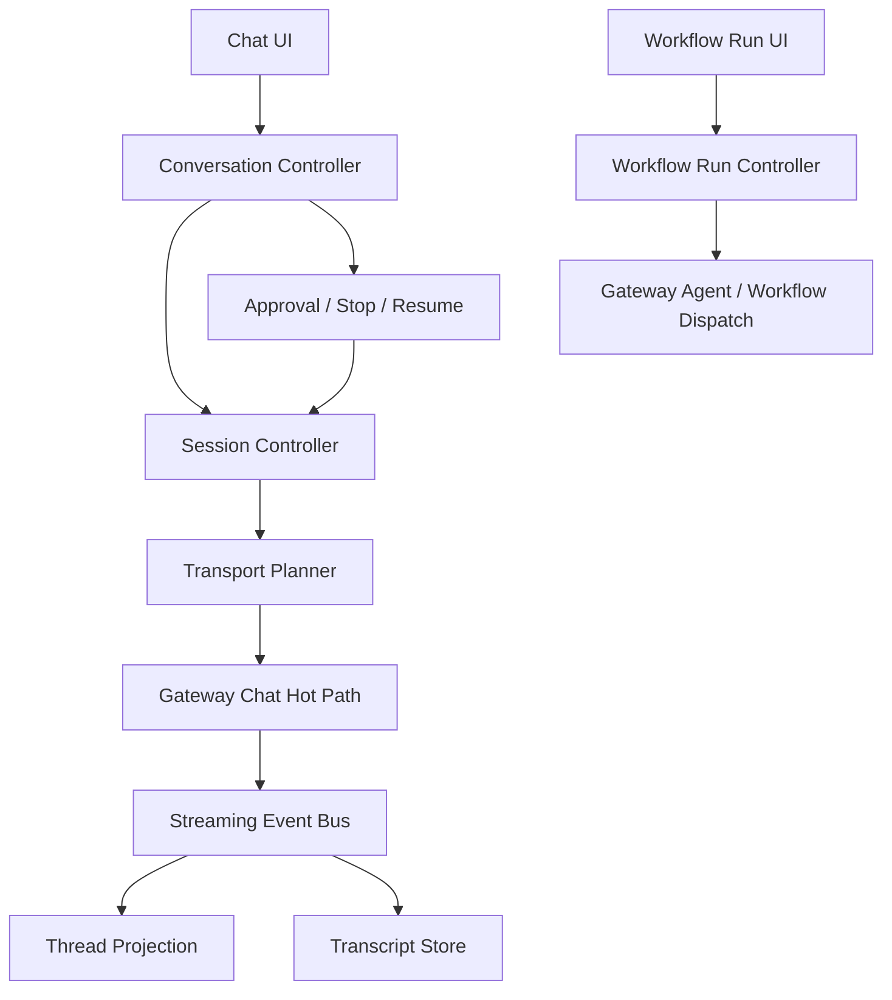

# OpenClaw 内核聊天模式正式设计稿

日期：2026-03-23  
状态：Formal Draft

## 1. 文档目标

本文档定义 Multi-Agent-Flow 在以 OpenClaw 为内核时的聊天模式正式设计。

目标不是把聊天做成“另一个工作流运行入口”，而是把它设计成一条低损耗、可恢复、可审计、可扩展的对话控制链路，同时保留正式执行模式的可控性。

本文档回答四个问题：

- 聊天模式应该和 OpenClaw 网页端对话有什么本质差异
- 当前软件为什么慢，慢在哪里
- 应该怎么设计成可长期维护的系统
- 什么时候算真正完成

## 2. 参考基线

### 2.1 ClawX 作为对照样本

ClawX 的价值不在于“功能更多”，而在于它把聊天路径做薄了：

- 前端聊天页独立
- chat store 独立
- renderer 只通过统一 gateway client 调用
- main process 负责 transport、进程生命周期和 fallback
- session 是一等对象，不挂在大工作台控制面里

这说明聊天模式的关键不是“多包一层控制台”，而是“把聊天热路径变短”。

### 2.2 我们当前软件现状

当前 chat/workbench 路径存在三类耦合：

- 聊天与工作流执行耦合
- thread/session/workflow identity 耦合
- UI 刷新与历史同步耦合

结果就是：

- 发送链路偏厚
- 历史回放偏重
- Stop 与恢复语义偏弱
- 线程边界不清晰

### 2.3 与 OpenClaw 网页端的差异

OpenClaw 网页端更接近“单一聊天壳”：

- 用户只关心一次输入和一次返回
- 主要路径通常是直接的 `chat.send` / 事件流 / 历史展示
- 不背负工作流编辑器、节点布局、设计态、Apply、任务看板等额外控制面

因此网页端的优势是链路短、心智简单。

我们不应把桌面端 chat 设计成网页端的复制品，而应做到：

- 保留网页端那种短链路体验
- 叠加桌面端独有的 thread 管理、投影、审批、恢复和多模式切换
- 不让这些增强能力进入发送关键路径

## 3. 设计原则

### 3.1 聊天优先短链路

聊天模式的首要指标不是“能不能跑”，而是：

- 首包快
- 可持续流式输出
- 不把历史同步放在关键路径

### 3.2 聊天与执行分治

- 聊天与执行不是两个产品，而是同一工作流的两个工作模式
- `chat` 负责自治协作，`run` 负责受控编排
- 两者共享底层能力，但不共享同一条控制骨架

### 3.3 线程是一等对象

- `Thread` 是用户叙事对象
- `Session` 是运行时对象
- 一个 `Thread` 可以绑定多个 `Session`
- chat / run / chat-to-run 必须可显式区分

### 3.4 控制面和观测面分离

控制面只决定“怎么跑”，观测面负责“跑了什么”。

观测面不能反向污染主链路。

### 3.5 档位优先于一刀切

工作流工作过程不应只有“看”或“不看”、“控”或“不控”两种极端。

系统应提供可选档位，让用户在速度、可见性、可控性、风险之间做选择。

原则是：

- 观测越强，速度通常越慢，但诊断能力越强
- 控制越强，速度通常越慢，但过程越可预测
- 档位由系统设计，选择权交给用户

### 3.6 首次接触即分流

`chat` 和 `run` 的差异不能只存在于内部实现，必须在用户第一次看到它们时就能被直觉识别。

要求是：

- 入口不共享同一个主按钮文案
- 图标、颜色、动词、默认行为必须不同
- `chat` 让人感到“先问、先聊、先看结果”
- `run` 让人感到“先执行、先控制、先看过程”
- 用户不需要读说明书，也不应该靠猜来区分

简单说，产品必须做到“看一眼就知道自己会得到什么”。

## 4. 目标架构

### 4.1 总体结构

### 4.2 一等对象

必须显式建模的对象：

- `Project`
- `Workflow`
- `Node`
- `Agent`
- `Thread`
- `Turn`
- `Session`
- `Dispatch`
- `Event`
- `Receipt`
- `Approval`
- `Artifact`
- `Projection`

### 4.3 工作模式定义

#### 4.3.1 `workflow.chat`

适用于工作流的聊天工作模式。

特征：

- 入口 agent 自治协作
- 软件只做边界治理
- 默认优先 `gateway_chat`
- 不再要求每次内部协作回到外部 orchestrator 逐节点重排程
- 支持多会话承载
- 默认入口文案应偏向“开始对话 / 继续对话 / 追问”
- 默认展示应偏向“结果、建议、摘要、对话连续性”
- 默认操作应偏向低阻力、低打断
- 视觉上应更轻、更开放、更像会话

#### 4.3.2 `workflow.run`

适用于工作流的正式执行工作模式。

特征：

- 软件主导编排
- 默认优先 `gateway_agent`
- 保持 dispatch / receipt / event 的完整语义
- 支持多会话承载
- 默认入口文案应偏向“开始运行 / 继续执行 / 重新执行”
- 默认展示应偏向“进度、节点、状态、控制点”
- 默认操作应偏向显式确认、暂停、恢复、终止
- 视觉上应更重、更明确、更像控制台

## 5. 聊天模式设计

### 5.1 核心路径

聊天路径只保留四步：

1. 解析 thread / session / policy
2. 发起 `chat.send`
3. 持续接收流式事件
4. 结束后异步补投影，不阻塞主回复

### 5.2 必须禁止的行为

- 不把聊天再挂到 workflow 执行主循环里
- 不在提交后同步刷新全量 history 作为主路径
- 不依赖布局顺序决定主入口 agent
- 不用 destructive merge 覆盖本地消息
- 不用全局 `isExecuting` 锁死整个工作台

### 5.3 线程语义

推荐线程类型：

- `conversation.autonomous`
- `conversation.assisted`
- `run.controlled`
- `inspection.readonly`

推荐线程状态：

- `draft`
- `running`
- `waiting_approval`
- `responded`
- `escalated_to_run`
- `failed`
- `closed`

### 5.4 多会话设计

一个 workflow 允许同时存在多个 session，但它们不应该混成一个不可解释的整体。

建议关系如下：

- 一个 `Thread` 可以绑定多个 `Session`
- 一个 `Thread` 在任一时刻只有一个 active session
- `chat -> run` 不是同一 session 的状态翻转，而是一次显式的 session 新建与 thread 续接
- `workflow.chat` 和 `workflow.run` 都可以形成多个历史 session

推荐 session 类型：

- `conversation.autonomous`
- `conversation.assisted`
- `run.controlled`
- `inspection.readonly`
- `recovery.assist`

推荐 session 生命周期：

- `created`
- `active`
- `paused`
- `completed`
- `aborted`
- `archived`

多会话的产品价值：

- 保留聊天叙事连续性
- 保留执行结果可回放性
- 允许用户在同一 workflow 下多次发起 chat / run / inspect
- 允许对历史 session 做恢复、对比、复盘

## 6. 控制面设计

### 6.1 Conversation Controller

职责：

- 管理 thread
- 管理 turn
- 管理流式状态
- 管理 stop / resume / escalate
- 生成 thread 投影

### 6.2 Session Controller

职责：

- 创建和恢复 session
- 绑定 thread 与 session
- 维护 session type
- 维护 gateway session key

### 6.3 Policy Controller

职责：

- 决定这次请求属于聊天还是执行
- 生成 agent allowlist
- 生成 file/tool scope
- 决定是否需要审批

### 6.4 Transport Planner

职责：

- 选择 `gateway_chat` / `gateway_agent` / fallback
- 记录 `plannedTransport`
- 在失败时记录 `actualTransport`

### 6.5 观测与控制档位

档位是工作流工作过程的用户可选策略。

#### 观测档位

- `O0 Minimal`
  - 只展示最终结果和最少状态
  - 速度最快
  - 诊断信息最少
- `O1 Live`
  - 展示流式输出和基础状态
  - 速度较快
  - 适合日常聊天
- `O2 Diagnostic`
  - 展示 message、tool、receipt、session 级信息
  - 速度中等
  - 适合排障和复盘
- `O3 Audit`
  - 展示完整 trace、投影、恢复游标、观测证据
  - 速度最慢
  - 适合审计和深度分析

#### 控制档位

- `C0 Boundary-Only`
  - 只做边界约束
  - 交给 agent 自主协作
  - 速度最快
  - 风险在于过程更不可见
- `C1 Guarded`
  - 加入 allowlist、stop、resume、scope 限制
  - 速度较快
  - 适合默认聊天
- `C2 Approval-Gated`
  - 敏感步骤需要审批
  - 速度中等
  - 适合高价值操作
- `C3 Fully Orchestrated`
  - 软件逐步调度和强控制
  - 速度最慢
  - 适合正式执行和高风险场景

#### 推荐组合

- `workflow.chat` 默认建议 `O1 + C1`
- `workflow.run` 默认建议 `O2 + C3`
- 调试/审计场景可提升到 `O3 + C2/C3`
- 追求极低延迟时可退到 `O0 + C0/C1`

#### 用户选择规则

- 档位由系统预置
- 用户可在发起会话前选择
- 档位切换只影响后续 session，不回填历史
- 系统必须在切换前提示速度、风险、可见性的变化

## 7. 数据与存储

### 7.1 写入原则

- Chat transcript 采用 append-first
- 历史同步只做投影增量，不做覆盖式重写
- message / task / receipt 的 thread metadata 必须一致

### 7.2 关键字段

建议统一字段：

- `threadID`
- `threadType`
- `threadMode`
- `threadOrigin`
- `entryAgentID`
- `projectSessionID`
- `gatewaySessionKey`

### 7.3 历史投影

必须分成两层：

- 原始 transcript
- UI projection

原始 transcript 不可被 UI projection 反向修改。

## 8. UI 设计

### 8.1 Chat 面

Chat 面必须是独立的，不再依赖 Workbench 的工作流编辑器状态作为主入口。

必备元素：

- 当前 thread
- 当前 agent
- 发送框
- 流式输出
- stop / resume
- 轻量 history selector

Chat 面的第一屏必须天然指向“对话”而不是“执行”：

- 标题使用对话语言，不使用运行语言
- 主按钮使用聊天动词，不使用执行动词
- 默认空状态展示最近会话、继续提问、继续追问
- 视觉风格更接近 conversational surface，而不是 command surface

### 8.2 Workbench 面

Workbench 保留：

- workflow 选择
- run 控制
- runtime 状态
- thread 列表入口

但不再承担聊天控制面的主职责。

Workbench 的第一屏必须天然指向“运行”而不是“对话”：

- 标题使用执行语言，不使用聊天语言
- 主按钮使用运行动词，不使用对话动词
- 默认空状态展示流程、控制、进度、节点
- 视觉风格更接近 control surface，而不是 conversational surface

## 9. 从 ClawX 学到什么

ClawX 适合借鉴的不是“界面风格”，而是三点：

- 聊天页独立，避免被工作台噪音污染
- chat store 独立，避免跨页面状态互相触发
- main process 统一 transport，renderer 不碰底层协议细节

我们要吸收的是“短链路 chat kernel”，不是复制它的产品面。

## 10. 迁移策略

### Phase 1：止血

- 去掉 chat 热路径上的全量 history refresh
- 将 thread / session / workflow identity 显式化
- 停止 destructive transcript merge

### Phase 2：分治

- 聊天控制面独立
- 执行控制面独立
- Stop / Resume thread-scoped

### Phase 3：投影化

- 原始 transcript 与 UI projection 分离
- 事件、receipt、artifact 分层
- Ops 侧按 thread / session / transport 观察

### Phase 4：优化

- 压缩热路径往返次数
- 建立首 token / 首包 / 完成时间基线
- 用 benchmark 回归保护

## 11. 完成性测试

以下测试全部通过，才算聊天模式正式设计完成并具备落地条件。

### 11.1 功能完成性

- `T1` 发送一条聊天消息后，UI 立即出现本地 optimistic echo
- `T2` 流式输出期间，界面持续更新，不依赖刷新按钮
- `T3` 同一 workflow 下新开 thread 不会污染旧 thread
- `T4` chat 升级为 run 时，必须显式生成新的 run session
- `T5` Stop 只影响当前 thread，不影响其他 thread
- `T6` `chat` 和 `run` 在首页入口、按钮文案和默认空状态上必须一眼可区分

### 11.2 语义完成性

- `T7` thread / session / workflow 三者在存储层可独立检索
- `T8` 历史回放不会覆盖本地已确认消息
- `T9` 重复拉取历史不会产生重复消息
- `T10` 入口 agent 选择由显式策略决定，不受布局变化影响
- `T11` 同一 workflow 可以同时存在多个 session，但只有一个 active session
- `T12` `chat -> run` 会生成新的 session，而不是污染原 session
- `T13` session 切换不会破坏 thread lineage

### 11.3 性能完成性

- `T14` 聊天提交链路上不再出现同步的全量 history 拉取
- `T15` 首回复延迟不被 UI 刷新和历史 merge 额外放大
- `T16` 与当前实现相比，`workflow.chat` 的端到端耗时必须显著低于现有 `gateway_chat` 基线
- `T17` 更高观测/控制档位必须带来可测量的额外耗时
- `T18` 更低观测/控制档位必须带来可测量的耗时下降

### 11.4 稳定性完成性

- `T19` gateway 重连后，当前 thread 可恢复
- `T20` 中断后再次发送仍然保持 thread 一致性
- `T21` 远端 history 暂不可用时，聊天仍可继续进行，最多降级投影，不中断主交互
- `T22` 档位切换不会导致 session 丢失或 thread 错乱
- `T23` 首次接触 chat/run 后，用户不需要二次解释就能分辨两者用途

### 11.5 可观测性完成性

- `T24` 每次会话都能记录 `plannedTransport` 与 `actualTransport`
- `T25` 每次 stop / resume 都能定位到 threadID 与 sessionKey
- `T26` Ops Center 可以按 thread 看到完整 turn / session / receipt 链路
- `T27` 每次会话都能记录所选观测档位和控制档位
- `T28` 观测/控制档位能在 UI 中明确告知速度与风险变化

## 12. 验收口径

满足以下条件，即认为正式设计可以进入实现阶段：

- 设计文档已冻结
- 数据模型字段已明确
- 聊天热路径已不再依赖工作流执行主循环
- thread / session / workflow 的职责边界已清楚
- 完成性测试矩阵已覆盖功能、语义、性能、稳定性、可观测性

## 13. 风险

- 旧逻辑和新逻辑并行时，最容易出现历史重复
- 线程化之后，Stop / Resume 的状态机要重新校准
- 如果继续允许 workflow 反向驱动聊天，会重新回到混线
- 如果 history merge 仍然是覆盖式，后续多线程会继续出错

## 14. 结论

聊天模式要想真正变快，关键不是“换一个入口”，而是把它从工作流执行骨架里剥离出来，形成独立的 conversation kernel。

对标 ClawX，我们要学的是：

- 独立 chat 页面
- 独立 session store
- 统一 transport owner
- 最小化热路径

但我们必须比它更进一步：

- 聊天与执行分治
- thread / session 显式拆分
- 历史投影非破坏式
- 完成性测试可验证
