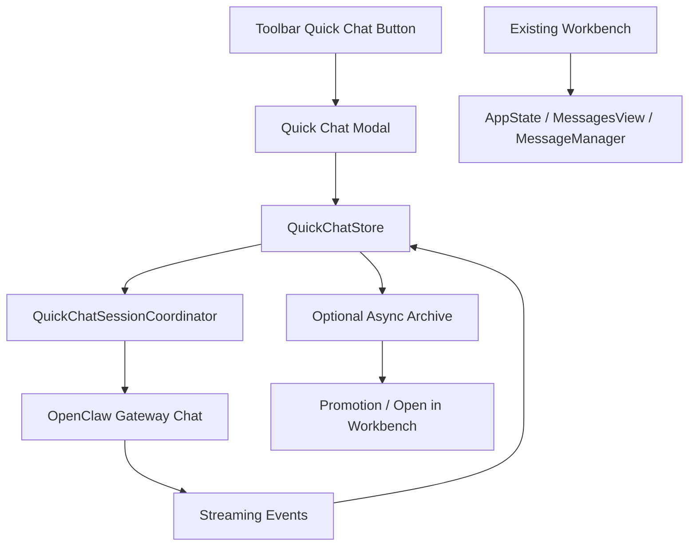

# OpenClaw 快聊天弹窗增量接入方案

日期：2026-03-24  
状态：Implementation Draft

## 1. 方案定位

本方案不替换现有 Workbench，不重写现有 `chat/run` 主体系，而是在现有软件中以补充能力的方式新增一个“快聊天弹窗”。

核心目标只有一句话：

**把聊天做成一条独立、够薄、够快、够顺滑的侧向链路，用最小侵入的方式接进当前系统。**

这意味着：

- 不在第一阶段大规模重构现有 Workbench
- 不让新聊天能力依赖现有 Workbench 的重控制面
- 不把快聊天会话和现有消息/任务主链路强行混写
- 保留后续把它升级为正式体系的可能性

## 2. 为什么采用弹窗增量方案

你担心的大刀阔斧改动风险是成立的，风险主要来自四点：

- 现有 Workbench 已经和 workflow、thread、history、runtime control plane 深度耦合
- 当前聊天路径慢，不只是网络慢，而是控制面过厚
- 如果直接在原地重做，很容易牵动 `MessagesView`、`AppState`、`OpenClawService`、`MessageManager`
- 一次改太多，回归范围会过大

因此更稳妥的策略是：

- 保留现有 Workbench 作为正式工作台
- 在旁边增加一个“Fast Chat Modal”
- 用独立状态、独立会话、独立热路径承载低延迟聊天
- 只在必要时把结果“提升”回主体系

## 3. 产品定义

### 3.1 名称

建议产品名直接叫：

- `Quick Chat`

不建议继续叫：

- `Workbench Chat`
- `Flow Chat`
- `Run Chat`

原因很简单：

- 它不是现有 Workbench 的同义入口
- 它的核心价值是快，而不是全功能
- 用户一看名字就应该理解这是“轻量即时聊天”

### 3.2 入口形态

第一阶段建议只提供一个稳定入口：

- 顶部工具栏按钮，点击后弹出 `.sheet`

后续可选扩展：

- `MessagesView` 头部快捷按钮
- 全局快捷键
- workflow 节点旁边的就近入口

### 3.3 打开方式

点击 `Quick Chat` 按钮后，弹出一个独立聊天面板。

建议特征：

- 默认中大尺寸 `.sheet`
- 不切走当前页签
- 关闭后回到原上下文
- 当前 workflow 自动作为默认聊天上下文

### 3.4 用户心智

用户必须在第一眼就知道它和现有主工作台不同：

- `Quick Chat` 是“先聊、先问、先拿建议”
- `Workbench` 是“正式工作、正式运行、正式观察”

一句话区分：

- `Quick Chat` 负责顺滑交互
- `Workbench` 负责正式控制

## 4. 非目标

第一阶段不做这些事：

- 不替换现有 `MessagesView`
- 不重写现有 thread/archive 文件体系
- 不让快聊天直接承担正式 `run.controlled`
- 不引入复杂多窗口
- 不要求和 Workbench 完全共享消息投影

## 5. 设计原则

### 5.1 独立热路径

快聊天必须走独立热路径，不能复用现有 Workbench 的厚链路。

### 5.2 读多写少

快聊天第一阶段以“轻写入”为原则：

- 热路径内尽量只写内存态和必要 session 映射
- 避免在发送关键路径内写 task、message、history projection、summary projection

### 5.3 先快后全

顺序必须是：

1. 先保证流畅
2. 再补可见性
3. 最后再补深集成

### 5.4 主体系不被污染

快聊天新增能力不能让现有 Workbench 更慢、更复杂、更不稳定。

## 6. 总体架构

### 6.1 架构选择

采用“旁路式聊天控制器”：



### 6.2 关键结论

快聊天不直接走：

- `submitWorkbenchPrompt`
- `prepareWorkbenchChatExecutionContext`
- `refreshWorkbenchHistory`
- `mergeWorkbenchTranscript`

快聊天应直接走：

- 独立 session 选择
- 独立 gateway chat 调用
- 独立 streaming UI
- 独立 stop / resume

## 7. 新增组件设计

### 7.1 `QuickChatStore`

这是 UI 状态中心，建议做成独立 `ObservableObject`。

职责：

- 当前弹窗是否打开
- 当前 workflow 上下文
- 当前快聊天 session
- 本地消息数组
- 发送状态
- 流式内容
- 错误状态
- stop / resume 状态

建议字段：

- `isPresented`
- `workflowID`
- `entryAgentID`
- `sessionKey`
- `messages`
- `streamingMessage`
- `sending`
- `activeRunID`
- `lastError`
- `controlPreset`
- `observationPreset`

### 7.2 `QuickChatSessionCoordinator`

这是运行时协调器，不放进现有 Workbench 流程。

职责：

- 创建和恢复 modal session
- 调用 gateway chat
- 绑定 runID / sessionKey
- 管理 stop
- 管理异步历史补拉

### 7.3 `QuickChatModalView`

这是弹窗主界面。

职责：

- 渲染消息列表
- 渲染流式输出
- 渲染输入框
- 展示当前 workflow / agent
- 提供 stop / clear / open in workbench

### 7.4 `QuickChatLauncherButton`

这是入口按钮，建议挂在 [ContentView.swift](/Users/chenrongze/Desktop/MultiAgentOrchestrator/MultiAgentOrchestrator/Multi-Agent-Flow/Sources/Views/ContentView.swift) 顶部工具栏区域。

原因：

- 所有主页面都能看到
- 不要求用户先切进 Workbench
- 弹窗心智更成立

## 8. 会话模型

### 8.1 会话分层

快聊天需要自己的轻量会话模型：

- `modal.ephemeral`
- `modal.pinned`
- `modal.promoted`

含义：

- `modal.ephemeral`
  - 临时会话
  - 仅在弹窗内存态存在
- `modal.pinned`
  - 已保存的快聊天历史
  - 仍不写入 Workbench 主消息流
- `modal.promoted`
  - 被用户显式提升到主体系
  - 可以在 Workbench 中继续跟踪

### 8.2 为什么不直接共用 Workbench thread

因为共用会马上带回现有问题：

- history refresh
- message merge
- global busy gate
- task/message 强写入
- thread summary 重算

所以第一阶段必须隔离。

### 8.3 与正式体系的关系

关系应该是：

- 快聊天默认独立
- 用户可显式“Open in Workbench”
- 用户可显式“Promote to Run”

不是：

- 每次发一条消息都立刻混入主体系

## 9. 聊天热路径

### 9.1 理想链路

```text
Open Modal
-> Resolve Workflow Context
-> Ensure Gateway Ready
-> Create / Reuse Quick Session
-> Optimistic User Echo
-> chat.send
-> Stream Events
-> Finalize Reply
-> Async Backfill (Optional)
```

### 9.2 必须避免的开销

快聊天主路径内不允许做这些事：

- 不创建 Workbench task
- 不写入 MessageManager 主消息流
- 不触发 Workbench thread summaries 全量重算
- 不调用 `refreshWorkbenchHistory`
- 不做 destructive merge
- 不受 `openClawService.isExecuting` 全局锁影响

### 9.3 推荐实现策略

发送时：

- 先本地追加 user echo
- 立即进入 sending 状态
- 直接调用 gateway chat
- 只订阅当前 modal session 的事件

结束时：

- 先完成 UI 回复
- 再异步做 history 补拉
- 若 history 失败，不影响已完成对话

## 10. 速度优化策略

### 10.1 首要优化点

要快，不是靠“调参”，而是靠少做事。

优先级从高到低：

1. 去掉热路径内的主体系写入
2. 去掉热路径内的 history refresh
3. 用独立 session state，避免全局 busy 竞争
4. 保持 gateway 连接常驻
5. 只做当前 session 的事件处理

### 10.2 首屏响应预算

建议把体验目标写成预算：

- 点击按钮到弹窗出现：`< 120ms`
- 输入提交到 optimistic echo：`< 16ms`
- 输入提交到 sending visible：`< 80ms`
- 不因主工作台刷新导致明显掉帧

### 10.3 首回复预算

如果 runtime 和 gateway 已就绪：

- 不允许再额外插入一次同步全量 history 读取
- 不允许因写入任务/消息主存储而阻塞首回复

## 11. 体验设计

### 11.1 视觉方向

快聊天要明显区别于 Workbench。

建议：

- 更轻的头部
- 更大的输入区
- 更少的流程控制元素
- 更强的消息沉浸感

### 11.2 第一屏内容

头部建议显示：

- `Quick Chat`
- 当前 workflow 名称
- 当前主入口 agent
- 当前档位提示

中部建议显示：

- 最近快聊天会话
- 示例提问
- 继续对话

底部建议显示：

- 输入框
- 发送按钮
- Stop 按钮
- `Open in Workbench`

### 11.3 弹窗内的差异化

快聊天里不展示这些内容作为默认主视觉：

- 节点级 dispatch 列表
- 复杂 runtime badges
- 过重的 thread picker
- 任务状态看板

这些都属于 Workbench，不属于 Quick Chat。

## 12. 观测与控制档位

快聊天也支持档位，但默认应更轻。

### 默认推荐

- 观测档位：`O1 Live`
- 控制档位：`C1 Guarded`

### 弹窗内仅暴露轻量档位切换

第一阶段建议只给三个用户选项：

- `Fast`
  - 最低可见性
  - 最小控制
  - 追求最快
- `Balanced`
  - 默认
  - 有基本可见性和 stop
- `Safe`
  - 更多可见性
  - 更强边界控制

内部映射建议：

- `Fast = O0 + C0`
- `Balanced = O1 + C1`
- `Safe = O2 + C2`

### 为什么不暴露全部档位

因为快聊天的目标是顺滑，不是配置过载。

## 13. 与现有体系的边界

### 13.1 可以复用的部分

- workflow / agent 上下文解析
- OpenClaw runtime readiness
- gateway 连接和 transport
- stop 基础能力
- entry agent 选择逻辑中的可复用部分

### 13.2 不应复用的部分

- Workbench 聊天提交链路
- Workbench 历史刷新链路
- Workbench 主消息列表
- Workbench 线程摘要重建
- Workbench run 状态 UI

## 14. 文件级实施建议

### 14.1 新增文件

建议新增：

- `Multi-Agent-Flow/Sources/Views/QuickChatModalView.swift`
- `Multi-Agent-Flow/Sources/Services/QuickChatStore.swift`
- `Multi-Agent-Flow/Sources/Services/QuickChatSessionCoordinator.swift`

### 14.2 修改文件

建议最小修改这些入口文件：

- [ContentView.swift](/Users/chenrongze/Desktop/MultiAgentOrchestrator/MultiAgentOrchestrator/Multi-Agent-Flow/Sources/Views/ContentView.swift)
  - 增加 `Quick Chat` 启动按钮
  - 增加 `.sheet`
- [MessagesView.swift](/Users/chenrongze/Desktop/MultiAgentOrchestrator/MultiAgentOrchestrator/Multi-Agent-Flow/Sources/Views/MessagesView.swift)
  - 可选增加 `Open Quick Chat` 按钮
- [AppState.swift](/Users/chenrongze/Desktop/MultiAgentOrchestrator/MultiAgentOrchestrator/Multi-Agent-Flow/Sources/Services/AppState.swift)
  - 只补上下文解析和 promotion 桥接
  - 不把快聊天主链路接进 `submitWorkbenchPrompt`

## 15. 分阶段实施

### Phase A：最小可用版

目标：

- 可以从工具栏打开弹窗
- 可以直接聊天
- 可以流式回复
- 可以 stop

不做：

- 会话持久化
- Open in Workbench
- 档位切换

### Phase B：顺滑版

目标：

- 增加轻量 session 列表
- 支持恢复最近会话
- 增加 `Fast / Balanced / Safe`
- 增加错误恢复和 gateway 重连恢复

### Phase C：桥接版

目标：

- 支持 `Open in Workbench`
- 支持 `Promote to Run`
- 支持异步归档

### Phase D：收束版

目标：

- 补齐日志、指标、benchmark
- 判断是否将其升级为主聊天体系

## 16. 风险控制

### 16.1 技术风险

- 如果快聊天直接写入主消息流，马上会失去“快”
- 如果 stop 仍走全局执行锁，弹窗体验会变差
- 如果 session 没隔离，多会话会重新混线

### 16.2 产品风险

- 如果入口叫法不清楚，用户会把它当成另一个 Workbench
- 如果默认给太多控制项，体验会重新变重
- 如果和主体系关系不清晰，用户会困惑“为什么这里找不到刚才的聊天”

### 16.3 解决方式

- 命名强调 `Quick`
- 默认隔离
- 显式提供 `Open in Workbench`
- 弹窗内提前说明“这是快速对话，不是正式工作台记录”

## 17. 完成性测试

### 17.1 功能

- `Q1` 点击工具栏按钮后，弹窗稳定打开
- `Q2` 弹窗内发送消息后立即出现 optimistic echo
- `Q3` 流式消息在弹窗内连续更新
- `Q4` Stop 只终止当前快聊天会话
- `Q5` 关闭弹窗不影响当前主工作台状态

### 17.2 性能

- `Q6` 点击按钮到弹窗可交互小于目标预算
- `Q7` 发送消息到 sending 状态无明显卡顿
- `Q8` 快聊天主路径不触发 Workbench 全量 history refresh
- `Q9` 快聊天主路径不创建 Workbench task/message 主记录

### 17.3 稳定性

- `Q10` gateway 断开后重新连接，快聊天可恢复继续使用
- `Q11` 多次打开关闭弹窗不会造成 session 错乱
- `Q12` 主工作台正在运行时，快聊天仍可独立工作

### 17.4 边界

- `Q13` 用户能明确分辨 Quick Chat 和 Workbench 的职责差异
- `Q14` 用户可手动把快聊天提升到主体系
- `Q15` 未提升前，快聊天不会污染主体系消息流

## 18. 实施建议结论

如果目标是：

- 风险小
- 速度快
- 体验好
- 不破坏现有体系

那么最优路线不是直接重做现有聊天，而是：

1. 先加一个独立的 `Quick Chat` 弹窗
2. 用独立 store 和独立 session 跑薄链路
3. 把 Workbench 保留给正式运行和正式观察
4. 通过 `Open in Workbench / Promote to Run` 做桥接

这条路线的最大优点是：

- 快聊天可以先单独成功
- 现有体系风险最小
- 后续无论保留双体系，还是反向收编，都有余地
