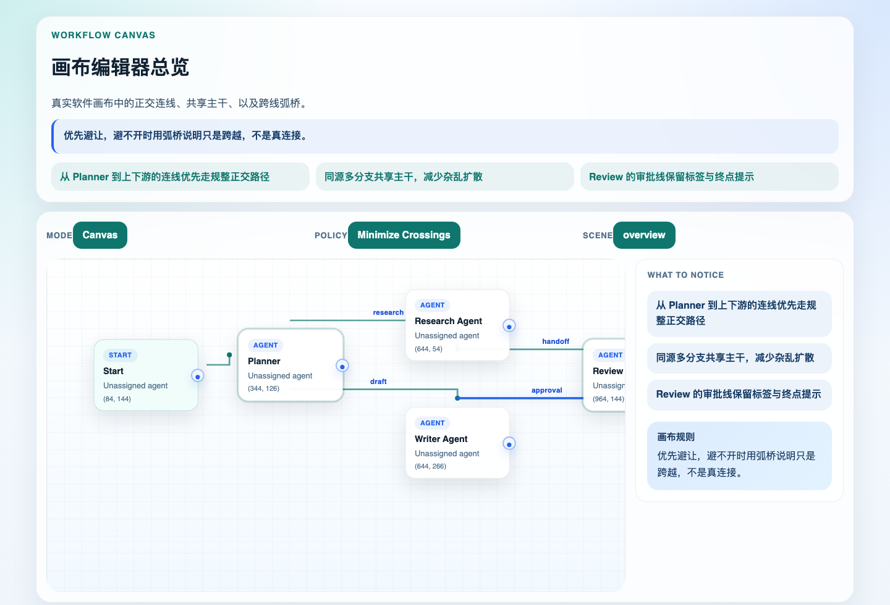
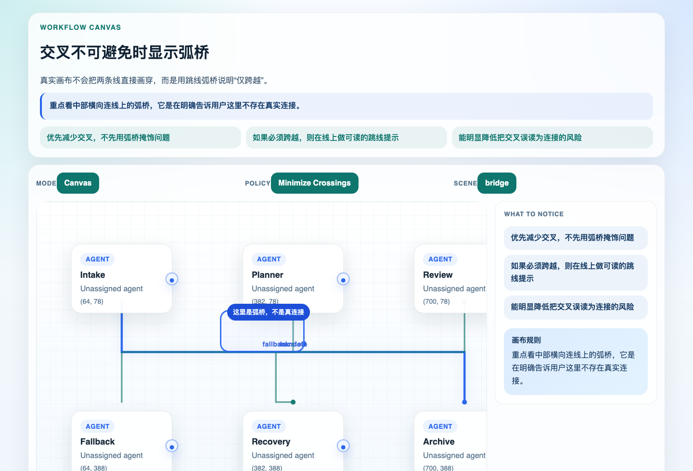
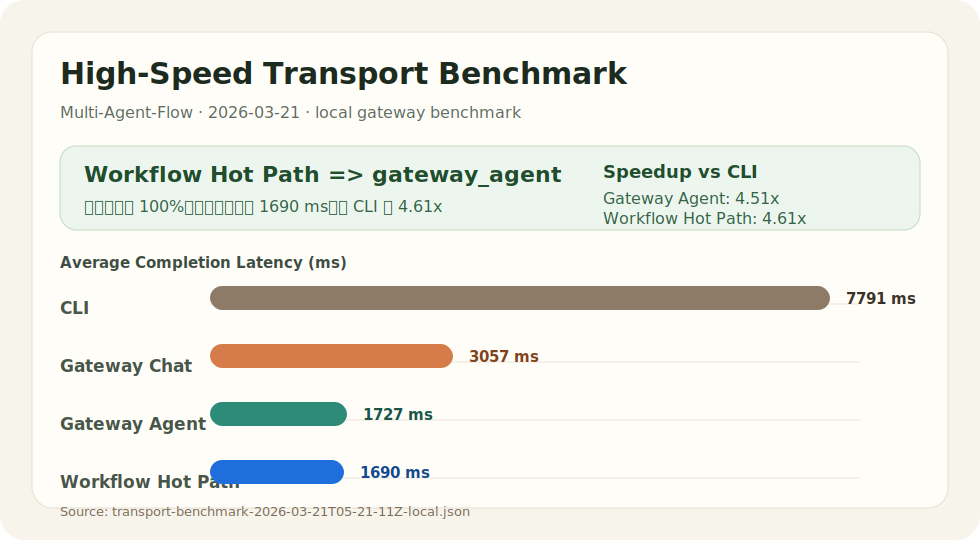

# Multi-Agent-Flow

Multi-Agent-Flow 是一个 macOS 桌面应用，用于管理多智能体项目、设计工作流、编排任务，并与 OpenClaw 网关进行连接和同步。

仓库中也已经包含新的 Electron + React + TypeScript 桌面壳，用于 macOS 与 Windows 的跨平台分发。

## 功能概览

- 项目管理
  - 新建、打开、保存、另存为、删除项目
  - 支持 `.maoproj` 项目文件
  - 自动保存与本地备份
- 工作流编辑
  - 可视化编辑智能体节点与连接关系
  - 支持缩放、画布视图、边界分组
  - 设计态下统一管理 Draft / Save / Apply
  - 节点本地受管配置文件编辑与统一 Apply 到 OpenClaw
  - 支持子流程（Subflow）嵌套
- 任务管理
  - 任务看板
  - 任务状态流转
  - 任务优先级与时间记录
- 消息与执行
  - 工作台会话
  - 执行结果查看
  - 运行过程状态展示
- OpenClaw 集成
  - 自动识别 OpenClaw Agents
  - 统一识别并读取 OpenClaw `SOUL.md`
  - 连接阶段基于备份执行 SOUL 安全对账
  - 连接 / 断开 / 检测连接
  - 导入识别到的 Agents
  - 保存 OpenClaw 会话相关数据
- 多语言支持
  - 简体中文
  - 繁体中文
  - English

## 技术栈

- Swift
- SwiftUI
- AppKit
- Combine
- Foundation

## 运行环境

- macOS 桌面应用
- 使用 Xcode 打开并运行
- 当前工程配置了较新的 macOS deployment target，请以项目文件中的设置为准；如果本地 Xcode 不匹配，先调整 target 再构建

## 快速开始

1. 使用 Xcode 打开 `Multi-Agent-Flow.xcodeproj`
2. 选择运行目标为 macOS
3. 点击运行按钮启动应用

如果你想在命令行中查看工程结构，可以先确认项目根目录下的文件布局，再直接在 Xcode 中构建。

## 画布编辑器

当前画布编辑器已经补齐一套更稳定的连线可视化规则：

- 连接线优先减少交叉
- 同源多分支优先共享主干
- 同目标多输入优先做汇流
- 避不开的交叉会显示弧桥，明确表示只是跨越而非真实连接





完整说明与更多验收图见：

- [画布编辑器介绍](Multi-Agent-Flow/Documentation/Workflow-Canvas-Editor-Overview.md)

## Workflow 编辑器语义

当前 Workflow Editor 已收口为“设计态优先”的编辑器，核心口径如下：

- Workflow Editor 负责可视化搭建 workflow 和 agent，不负责在编辑器内执行 workflow
- 所有结构编辑先进入 draft，`Save` 保存 `.maoproj`，`Apply` 才把待生效配置推送到 OpenClaw
- agent 配置编辑采用 node-local managed workspace 模型，编辑的是节点下受管有效副本，不是外部源文件实时同步
- agent 节点标题固定等于 agent 名称，避免节点身份与 agent 身份分裂

详细说明见：

- [Workflow Editor Guide](Multi-Agent-Flow/Documentation/Workflow-Editor-Guide.md)
- [Workflow 编辑器 Mirror-Only 升级方案](Multi-Agent-Flow/Documentation/workflow-editor-mirror-only-upgrade-plan-zh-2026-03-22.md)

## 验收验证

OpenClaw agent runtime protocol 的端到端验收可以在仓库根目录运行：

```bash
npm run validate:openclaw-runtime
```

这个命令会同时校验：

- `.maoproj` runtime protocol 兼容性 fixture
- Swift 侧 runtime protocol 持久化与 trace 查询验收用例

## OpenClaw SOUL 同步

当前版本已经补齐 OpenClaw Agent 的 `SOUL.md` 读取、导入与连接后同步链路，重点能力包括：

- 统一搜索 `SOUL.md` / `soul.md` 以及 `agent`、`private` 等常见目录位置
- 在识别结果中保存真实 `soulPath`，减少后续导入与同步时的路径漂移
- 连接 OpenClaw 时先基于会话备份执行安全对账，再决定是否更新项目内容
- 冲突场景不自动替用户做覆盖决策，避免后台静默覆盖远端 SOUL
- 模板库支持将现有 `SOUL.md` 反向导入为模板，并继续保持管理字段与 SOUL 内容隔离
- 模板选择器会根据当前 agent 的身份、能力、描述和 SOUL 内容给出推荐模板
- 模板编辑器和校验页支持对缺失 SOUL 字段做保守式自动补齐
- 校验扫描页支持按当前筛选结果批量自动补齐可修复模板
- 校验扫描页支持识别并清理 `SOUL.md` 中泄漏的管理信息
- 清理前可预览字段级差异，确认后再执行单个或批量清理

详细设计与规则见：

- [OpenClaw SOUL 同步与安全对账](docs/openclaw-soul-sync.md)
- [Agent 模板库与 SOUL 纯净原则](docs/agent-template-library.md)

## 阶段验证：高速通信热路径

最新阶段报告见：

- [高速通信热路径阶段报告](Multi-Agent-Flow/Documentation/high-speed-transport-stage-report-2026-03-21.md)

当前对外展示口径：

- `workflow_hot_path` 在 live benchmark 中 `100%` 命中 `gateway_agent`
- 平均完成耗时 `1690 ms`
- 相比 CLI 的 `7791 ms` 提升约 `4.61x`



## 打包与安装

### Electron 桌面壳（macOS + Windows）

跨平台桌面壳位于 `apps/desktop`，可在仓库根目录运行：

```bash
npm run desktop:dist:mac
npm run desktop:dist:win
```

产物输出到 `apps/desktop/release/`。

说明：

- 图标资产已经随仓库提交，打包时会优先复用这些资产，因此 GitHub Actions 的 macOS / Windows runner 不需要额外安装 Pillow
- 如果你在 macOS 上更新了 `apps/desktop/buildResources/icon-source.svg`，可以执行 `npm run build:assets:refresh --workspace @multi-agent-flow/desktop` 重新生成 `icon.png`、`icon.ico`、`icon.icns`
- 当前 macOS 本地产物可以成功生成 `.app` 和 `.dmg`，但若未配置 Apple notarization 凭据，`electron-builder` 会跳过公证，这不影响本机验证，但会影响对外分发体验
- Windows 真实安装包由 `.github/workflows/desktop-packaging.yml` 在 `windows-latest` 上生成，格式为 NSIS `x64` 安装包

### Swift 原生应用（现有 macOS 版本）

如果你想直接生成可分发的 macOS 安装产物，可以在项目根目录运行：

```bash
./scripts/package-macos.sh
```

脚本会自动完成以下操作：

- 以 `Release` 配置构建应用
- 生成 `dist/Multi-Agent-Flow.app`
- 生成 `dist/Multi-Agent-Flow-macOS.zip`
- 生成 `dist/Multi-Agent-Flow-macOS.dmg`

安装方式：

- 本机使用：直接打开 `dist/Multi-Agent-Flow.app`
- 分发安装：把 `.app` 拖到 `Applications`，或者把 `.dmg` 发给其他 Mac 用户

说明：

- 当前工程能生成已签名的本地构建，但如果要在其他机器上避免 Gatekeeper 拦截，通常还需要使用 `Developer ID Application` 证书并做 notarization（苹果公证）
- 如果只是本机开发和测试使用，当前生成的 `.app` / `.dmg` 已经够用

## 发布签名与公证

如果你想把应用分发给其他 Mac 用户，建议使用发布脚本：

```bash
./scripts/release-macos.sh
```

这个脚本会完成：

- `archive` 项目
- 使用 `Developer ID Application` 证书导出发布版 `.app`
- 提交苹果 notarization
- 对 `.app` 和 `.dmg` 执行 `staple`
- 生成最终可分发的 `dist/` 产物

发布前请先准备两个前置条件：

1. 登录钥匙串中存在 `Developer ID Application` 证书
2. 已经为 `notarytool` 配置认证

推荐先做预检：

```bash
./scripts/release-macos.sh --preflight
```

如果你选择使用 Keychain Profile 保存 notarization 凭据，可以先执行：

```bash
xcrun notarytool store-credentials "multi-agent-flow-notary" \
  --apple-id "your-apple-id@example.com" \
  --team-id "4TPD585PDN"
```

然后执行：

```bash
NOTARY_KEYCHAIN_PROFILE=multi-agent-flow-notary ./scripts/release-macos.sh
```

也支持以下环境变量方式：

- `DEVELOPER_ID_APPLICATION`
- `NOTARY_KEYCHAIN_PROFILE`
- `NOTARY_APPLE_ID` + `NOTARY_PASSWORD` + `NOTARY_TEAM_ID`
- `NOTARY_API_KEY_PATH` + `NOTARY_API_KEY_ID` + `NOTARY_API_ISSUER`

补充说明：

- 当前工程的 `MACOSX_DEPLOYMENT_TARGET` 仍以项目设置为准；如果你准备对外分发，建议再确认目标系统版本是否符合预期
- 如果只想验证发布签名流程、不做公证，可以临时使用 `NOTARIZE=0 ./scripts/release-macos.sh`

## 基本使用

### 1. 创建或打开项目

- 使用菜单或快捷键新建项目
- 通过打开 `.maoproj` 文件加载已有项目
- 项目会保存在本地文档目录下的 `Multi-Agent-Flow` 文件夹中

### 2. 编辑工作流

- 在左侧导航切换到工作流编辑器
- 添加智能体节点、连接节点、配置属性
- 使用缩放控件查看画布细节
- 如需复用复杂逻辑，可以创建子流程节点

### 3. 管理任务

- 在工作台或看板中查看任务
- 任务支持待办、进行中、已完成、阻塞四种状态
- 可为任务设置优先级、标签和关联节点

### 4. 连接 OpenClaw

- 通过底部状态栏检查连接状态
- 先执行自动识别，再手动连接或导入 Agents
- 在设置中调整 OpenClaw 相关配置

## 常用快捷键

- `⌘N` 新建项目
- `⌘O` 打开项目
- `⌘S` 保存项目
- `⌘⇧S` 另存为
- `⌘⇧I` 导入架构
- `⌘⇧E` 导出架构
- `⌘,` 打开设置

## 数据存储位置

应用会在本地生成以下目录：

- 项目文件：`~/Documents/Multi-Agent-Flow/`
- 备份：`~/Documents/Multi-Agent-Flow/backups/`
- OpenClaw 会话：`~/Documents/Multi-Agent-Flow/openclaw-sessions/`
- 工作区：`~/Library/Application Support/Multi-Agent-Flow/Workspaces/`

## 项目结构

- `Multi-Agent-Flow/`
  - `Sources/Models/` 数据模型
  - `Sources/Services/` 状态管理与服务层
  - `Sources/Views/` SwiftUI 界面
  - `Sources/Utils/` 通用工具
  - `Documentation/` 功能说明文档
- `Multi-Agent-Flow.xcodeproj/` Xcode 工程文件

## 相关文档

- [工作流编辑器指南](Multi-Agent-Flow/Documentation/Workflow-Editor-Guide.md)
- [OpenClaw SOUL 同步与安全对账](docs/openclaw-soul-sync.md)
- [Agent 模板库与 SOUL 纯净原则](docs/agent-template-library.md)
- [导入导出指南](Multi-Agent-Flow/Documentation/Import-Export-Guide.md)
- [OpenClaw 远程执行指南](Multi-Agent-Flow/Documentation/OpenClaw-Remote-Execution.md)
- [高速通信热路径阶段报告](Multi-Agent-Flow/Documentation/high-speed-transport-stage-report-2026-03-21.md)
- [OpenClaw Agent Runtime 协议](docs/openclaw-agent-runtime-protocol.md)
- [嵌套子流程使用指南](Multi-Agent-Flow/Documentation/Subflow-Usage-Guide.md)

## 备注

- 项目使用本地文件进行持久化，没有看到额外的第三方依赖管理文件
- 待补充：
  - 截图
  - 架构图
  - 打包与发布说明
  - OpenClaw 配置示例
